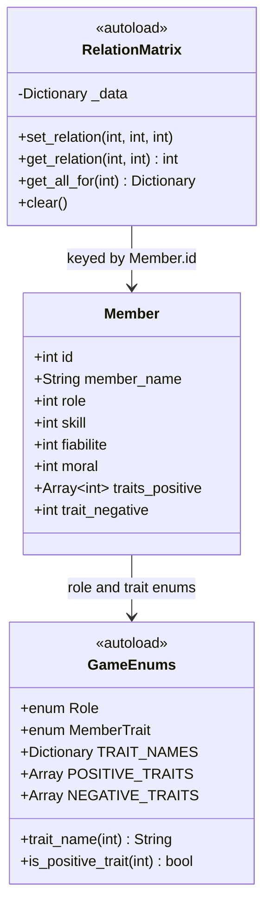

# F01 — Member Data Model: Architecture

## Confirmed Decisions

| # | Question | Answer | Impact |
|---|---|---|---|
| Q1 | Stats type & range | All 3 active stats (`skill`, `fiabilite`, `moral`) are `int`, 0–100. `experience` excluded for now. | No float math, no experience field on Member |
| Q2 | Trait storage | Option A — enum indices (`int`) stored on Member, metadata in a lookup table in `GameEnums` | No extra Resource files per trait |
| Q3 | Relations consistency | Central `RelationMatrix` autoload singleton manages all pairs | Guaranteed symmetry; Member holds no relation data directly |

---

## File Structure

```
game/
├── project.godot
└── src/
    ├── autoloads/
    │   ├── GameEnums.gd        ← Role + MemberTrait enums + metadata lookup
    │   └── RelationMatrix.gd   ← central symmetric relation store
    └── resources/
        └── Member.gd           ← Member Resource (pure data)
```

---

## Component Contracts

### `GameEnums.gd` (Autoload)

Global enums and static lookup tables. No state.

```gdscript
extends Node

enum Role { TANK, HEALER, DPS }

enum MemberTrait {
    # Positive
    ENTHOUSIASTE,
    LOYAL,
    DRAMA_QUEEN,
    MAIN_FROIDE,
    LOOTER,
    MENTOR,
    # Negative
    AFK_FREQUENT,
}

const TRAIT_NAMES: Dictionary = {
    MemberTrait.ENTHOUSIASTE: "Enthousiaste",
    MemberTrait.LOYAL:        "Loyal",
    MemberTrait.DRAMA_QUEEN:  "Drama Queen",
    MemberTrait.MAIN_FROIDE:  "Main Froide",
    MemberTrait.LOOTER:       "Looter",
    MemberTrait.MENTOR:       "Mentor",
    MemberTrait.AFK_FREQUENT: "AFK Fréquent",
}

const POSITIVE_TRAITS: Array = [
    MemberTrait.ENTHOUSIASTE,
    MemberTrait.LOYAL,
    MemberTrait.DRAMA_QUEEN,
    MemberTrait.MAIN_FROIDE,
    MemberTrait.LOOTER,
    MemberTrait.MENTOR,
]

const NEGATIVE_TRAITS: Array = [
    MemberTrait.AFK_FREQUENT,
]

func trait_name(trait_id: int) -> String:
    return TRAIT_NAMES.get(trait_id, "Unknown")

func is_positive_trait(trait_id: int) -> bool:
    return trait_id in POSITIVE_TRAITS
```

---

### `Member.gd` (Resource)

Pure data. No logic, no scene dependencies.

```gdscript
class_name Member
extends Resource

var id: int
var member_name: String
var role: int              # GameEnums.Role value

var skill: int             # 0–100
var fiabilite: int         # 0–100
var moral: int             # 0–100

var traits_positive: Array[int]   # exactly 2 values from GameEnums.MemberTrait
var trait_negative: int           # exactly 1 value from GameEnums.MemberTrait
```

Relations are **not** stored on Member — they live in `RelationMatrix`.

---

### `RelationMatrix.gd` (Autoload singleton)

Guarantees symmetry: `get(a, b) == get(b, a)` always.

```gdscript
extends Node

# _data[id_a][id_b] mirrors _data[id_b][id_a]
var _data: Dictionary = {}

func set_relation(id_a: int, id_b: int, value: int) -> void:
    value = clampi(value, 0, 100)
    _ensure(id_a)
    _ensure(id_b)
    _data[id_a][id_b] = value
    _data[id_b][id_a] = value

func get_relation(id_a: int, id_b: int) -> int:
    if _data.has(id_a) and _data[id_a].has(id_b):
        return _data[id_a][id_b]
    return 0

func get_all_for(id: int) -> Dictionary:
    return _data.get(id, {})

func clear() -> void:
    _data.clear()

func _ensure(id: int) -> void:
    if not _data.has(id):
        _data[id] = {}
```

---

## Data Flow Diagram



---

## No API Changes

F01 is a pure GDScript data model inside the Godot client. No GoLang backend endpoints are introduced or modified at this stage.

---

## Specification Improvements

| Proposal | Engineering Impact | Tradeoff |
|---|---|---|
| Add `experience` field as `int` (even if unused) now | Near-zero cost; avoids a future breaking change to the Resource schema | Slight confusion if the field is visible but always 0 |
| Define `equipment_points: int = 0` on Member now | F09 (Loot) will need it; adding it later forces touching Member again | Minor field bloat on F01 |
| Add `const GUILD_SIZE = 8` to `GameEnums` | Centralises the hardcoded guild size used by RelationMatrix and generation logic | Premature if size could change in design |

---

## Open Questions

None — all Q1–Q3 answered and captured above.
