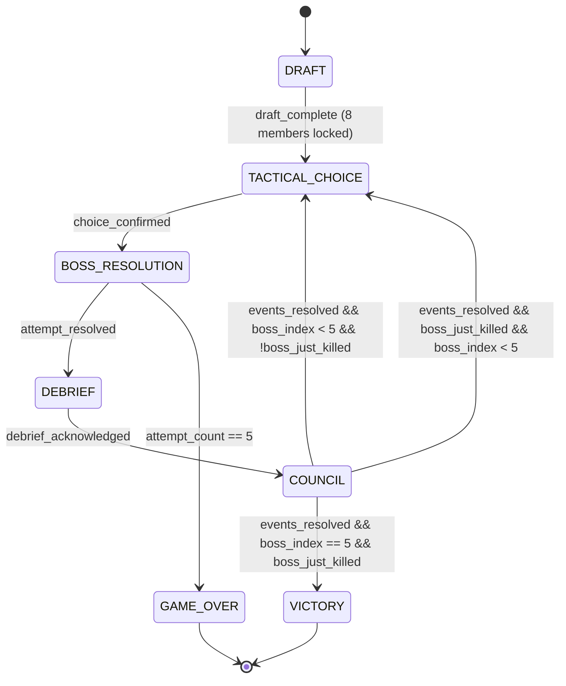
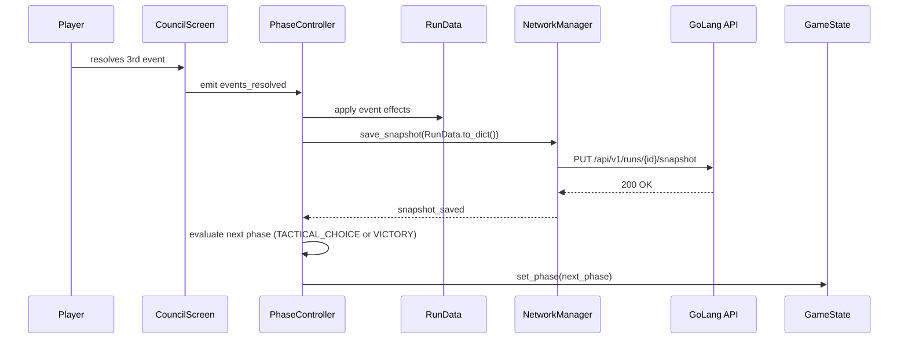

# Architecture — `boucle_de_jeu_principale`

## Scope

MVP vertical slice: **1 tier, 5 bosses**. All core loop systems active. Conflict system excluded. Tier-end sequence excluded.

---

## Confirmed Decisions

| # | Decision | Architectural Impact |
|---|---|---|
| Q1 | **Online required** | `NetworkManager` is a hard dependency; connection error screen needed; no local persistence fallback |
| Q2 | **Static `.tres` resources** | Boss, event, member data bundled with game; no content API; updates via patch |
| Q3 | **Save after every inter-raid** | `save_snapshot()` called at end of `COUNCIL` phase; phase transition blocked until save confirmed |
| Q4 | **Client-side draft pool, no swap abstraction** | `DraftSystem.gd` generates pool directly; simpler implementation |
| Q5 | **1 tier, 5 bosses** | `TIER_END` state excluded from MVP FSM; `tier` field hardcoded to `1` in data model for future expansion |
| Q6 | **No conflict system in MVP** | No `ConflictManager`; no conflict penalties on boss resolution; council pool limited to 3 categories |
| Q7 | **Include minimal rubber band** | 1 trigger: 3 consecutive wipes on same boss → hero surge on 1 random member |

---

## Layer Decomposition

```
┌─────────────────────────────────────────────────────────────┐
│  Layer 5 — GoLang Backend                                   │
│  Run persistence · Run completion · Leaderboard             │
├─────────────────────────────────────────────────────────────┤
│  Layer 4 — GoDot Scenes (presentation only)                 │
│  DraftScreen · TacticalChoiceScreen · BossResolutionScreen  │
│  DebriefScreen · CouncilScreen · VictoryScreen · GameOverScreen │
│  HUD (persistent overlay)                                   │
├─────────────────────────────────────────────────────────────┤
│  Layer 3 — GDScript Logic Services (pure, no scene deps)    │
│  DraftSystem · BossResolver · CouncilEventSystem            │
│  DebriefGenerator · RubberBandSystem                        │
├─────────────────────────────────────────────────────────────┤
│  Layer 2 — GDScript Autoloads (mutable run state)           │
│  GameState · RunData · MemberRegistry · NetworkManager      │
├─────────────────────────────────────────────────────────────┤
│  Layer 1 — GDScript Resources (immutable data definitions)  │
│  MemberData · BossData · EventCardData · TacticalChoiceData │
│  TraitData                                                  │
└─────────────────────────────────────────────────────────────┘
```

**Layer boundary rule:** Scenes read from Autoloads and emit signals. They never mutate Autoloads directly. A `PhaseController` node on `Main.tscn` connects scene signals to Autoload mutations and Logic Service calls.

---

## Phase State Machine

`GameState.gd` owns the FSM. It emits `phase_changed(new_phase: Phase)`. `Main.tscn` listens and swaps the active scene. No other node controls scene flow.



> Note: When a boss is killed, `boss_index` increments and `attempt_count` resets to 0. The inter-raid council still fires after a kill (the guild debriefs even after a win).

---

## Data Model

### Autoloads (mutable run state)

```gdscript
# GameState.gd
enum Phase { DRAFT, TACTICAL_CHOICE, BOSS_RESOLUTION, DEBRIEF, COUNCIL, VICTORY, GAME_OVER }
var current_phase: Phase
var boss_just_killed: bool
signal phase_changed(new_phase: Phase)

# RunData.gd
var run_id: String            # UUID from backend on POST /runs
var tier: int = 1             # hardcoded for MVP; present for schema compatibility
var boss_index: int           # 1–5
var attempt_count: int        # 0–4; reaching 5 → GAME_OVER
var consecutive_wipes: int    # rubber band trigger counter; resets on kill or boss change
var rubber_band_active: bool  # hero surge flag for next resolution
var last_attempt_result: Dictionary  # { "outcome": String, "score": float, "threshold": float, "underperformer_id": String }

# MemberRegistry.gd
var members: Array[MemberData]   # always exactly 8 after draft
func get_member(id: String) -> MemberData
func apply_morale_delta(id: String, delta: int) -> void
func apply_xp(id: String, xp: int) -> void
```

### Resources (immutable definitions)

```gdscript
# MemberData.gd (extends Resource)
@export var id: String
@export var display_name: String
@export var role: String           # "tank", "healer", "dps_melee", "dps_range", "support"
@export var skill: float           # 0.0–1.0 base effectiveness
@export var reliability: float     # 0.0–1.0 consistency modifier
@export var morale: int            # 0–100; affects resolution score
@export var traits: Array[String]  # trait IDs

# BossData.gd (extends Resource)
@export var id: String
@export var display_name: String
@export var position: int          # 1–5
@export var difficulty_rating: float  # tunable; used in threshold calculation

# EventCardData.gd (extends Resource)
@export var id: String
@export var category: String       # "membre", "ressource", "externe"
@export var title: String
@export var description: String
@export var choices: Array[Dictionary]  # [{ "label": String, "effects": Array[Dictionary] }]
@export var weight_base: int          # base draw weight
@export var weight_conditions: Array[Dictionary]  # [{ "condition": String, "multiplier": float }]

# TacticalChoiceData.gd (extends Resource)
@export var id: String
@export var category: String       # "composition", "strategy", "consumable"
@export var label: String
@export var score_modifier: float  # additive modifier to resolution score
```

---

## Core Algorithms

### Boss Resolution (BossResolver.gd)

```gdscript
const BASE_SKILL_WEIGHT := 1.0
const MORALE_SCALE := 0.005        # morale 100 = +0.5 bonus
const BOSS_POSITION_MULTIPLIERS := [0.0, 0.6, 0.75, 0.85, 0.95, 1.0]

func resolve_attempt(
    members: Array[MemberData],
    boss: BossData,
    tactical_choice: TacticalChoiceData,
    rubber_band_active: bool
) -> Dictionary:
    var score := 0.0
    for m in members:
        score += m.skill * m.reliability * (1.0 + m.morale * MORALE_SCALE)
    score /= members.size()
    score += tactical_choice.score_modifier
    if rubber_band_active:
        score += _apply_hero_surge(members)  # +0.25 skill on random member for this attempt

    var threshold := boss.difficulty_rating * BOSS_POSITION_MULTIPLIERS[boss.position]

    return {
        "outcome": "kill" if score >= threshold else "wipe",
        "score": score,
        "threshold": threshold,
        "underperformer_id": _find_underperformer(members)
    }
```

### Council Event Selection (CouncilEventSystem.gd)

```gdscript
# MVP pool: 3 categories (Membre, Ressource, Externe) — no Conflit category
func draw_events(run_data: RunData, member_registry: MemberRegistry) -> Array[EventCardData]:
    var pool := _build_weighted_pool(run_data, member_registry)
    var drawn: Array[EventCardData] = []
    for i in 3:
        var event := _weighted_draw(pool)
        drawn.append(event)
        pool.erase(event)  # no duplicates in same inter-raid
    return drawn

func _build_weighted_pool(run_data, registry) -> Array:
    var pool := _all_event_cards.duplicate()
    var avg_morale := registry.average_morale()
    for card in pool:
        var w := card.weight_base
        if avg_morale < 40 and card.category == "membre":
            w = int(w * 3.0)
        if run_data.resources.get("gold", 0) == 0 and card.category == "ressource":
            w = int(w * 3.0)
        card.set_meta("draw_weight", w)
    return pool
```

### Rubber Band (RubberBandSystem.gd)

```gdscript
const CONSECUTIVE_WIPE_TRIGGER := 3

func check_and_apply(run_data: RunData) -> void:
    if run_data.consecutive_wipes >= CONSECUTIVE_WIPE_TRIGGER:
        run_data.rubber_band_active = true
        run_data.consecutive_wipes = 0
    # rubber_band_active is consumed by BossResolver on next attempt and reset to false
```

---

## Scene Hierarchy

```
Main.tscn
├── CanvasLayer z=10 (HUD — always rendered on top)
│   └── HUD.tscn           # boss_index/5 · attempt_count/5 · player label
├── SceneContainer (Node — active scene swapped here by PhaseController)
└── CanvasLayer z=20 (TransitionLayer — fade overlays)
    └── SceneTransition.tscn
```

**Phase → Scene mapping:**

| Phase | Scene |
|---|---|
| `DRAFT` | `DraftScreen.tscn` |
| `TACTICAL_CHOICE` | `TacticalChoiceScreen.tscn` |
| `BOSS_RESOLUTION` | `BossResolutionScreen.tscn` |
| `DEBRIEF` | `DebriefScreen.tscn` |
| `COUNCIL` | `CouncilScreen.tscn` |
| `VICTORY` | `VictoryScreen.tscn` |
| `GAME_OVER` | `GameOverScreen.tscn` |

**PhaseController signal contract** (all scenes emit these; `PhaseController` on `Main.tscn` connects them):

| Signal | Emitted by | Effect |
|---|---|---|
| `draft_complete(members: Array[MemberData])` | DraftScreen | Lock members in MemberRegistry; advance to TACTICAL_CHOICE |
| `choice_confirmed(choice: TacticalChoiceData)` | TacticalChoiceScreen | Store choice; advance to BOSS_RESOLUTION |
| `attempt_resolved` | BossResolutionScreen | Advance to DEBRIEF |
| `debrief_acknowledged` | DebriefScreen | Draw council events; advance to COUNCIL |
| `events_resolved` | CouncilScreen | Save snapshot; evaluate next phase |
| `screen_dismissed` | Victory/GameOver | Return to main menu |

---

## Save Flow



> Phase transition is **gated on `snapshot_saved`**. On API failure, a retry dialog is shown. The player cannot proceed until the snapshot is confirmed.

---

## Backend API

All endpoints under `/api/v1`. See `docs/api/openapi.yaml` for full schema.

| Method | Path | Description |
|---|---|---|
| `POST` | `/runs` | Start a new run; returns `run_id` |
| `GET` | `/runs/{id}` | Fetch run snapshot (resume on app relaunch) |
| `PUT` | `/runs/{id}/snapshot` | Save full run state JSON blob |
| `POST` | `/runs/{id}/complete` | Finalize run (win or game-over); submit score |
| `GET` | `/leaderboard` | Top completed runs |

**Snapshot payload schema** (`PUT /runs/{id}/snapshot` body):
```json
{
  "tier": 1,
  "boss_index": 3,
  "attempt_count": 1,
  "consecutive_wipes": 0,
  "rubber_band_active": false,
  "phase": "TACTICAL_CHOICE",
  "members": [{ "id": "...", "skill": 0.8, "reliability": 0.7, "morale": 65, "traits": [] }],
  "resources": { "gold": 120, "potions": 2 }
}
```

No API changes to existing routes (none existed). Full spec in `docs/api/openapi.yaml`.

---

## Open Questions

None that block implementation.

Post-MVP candidates (not decisions):
- Conflict system (System 07) — natural second pass
- Tier system (Systems 08, 09 full scope) — natural third pass
- Leaderboard display in-game — UI work, not blocked by architecture

---

## Specification Improvements

### 1 — Boss kill still triggers inter-raid (spec ambiguous)
**Proposal:** The spec describes the inter-raid loop as occurring after wipes, but doesn't explicitly state whether killing a boss also triggers a council session. The architecture assumes **yes** (the guild always debriefs), which creates narrative continuity. The council event pool should include kill-specific events ("We beat Ragnaros. Kévin wants a statue of himself in the guild hall.").
**Engineering impact:** Low — just requires a `kill_context` flag on event cards for weighted drawing. **Tradeoff:** Adds pool authoring work; skip it for MVP and draw from the same pool regardless of outcome.

### 2 — Attempt count semantics: per-boss or per-run
**Proposal:** The spec says "5 wipes = game over" but doesn't clarify if this is cumulative across all bosses or per-boss. The architecture implements it as **cumulative per-boss, reset on kill**. This means a player can wipe 4 times on boss 2, kill it, then start boss 3 with a fresh counter.
**Engineering impact:** None — `attempt_count` is already reset in `RunData` on kill. **Tradeoff:** A per-run counter would be more punishing and remove the safety valve of "just kill it before 5." Recommend confirming this intent with the game designer.

### 3 — Draft skip mechanic not fully specified
**Proposal:** System 06 mentions a skip mechanic for unwanted draws, but the penalty/limit is not specified in the readable specs. The architecture reserves a `skip_count` field in `DraftSystem.gd` but leaves the rule undefined.
**Engineering impact:** Low — requires 1 additional rule constant and 1 UI state in DraftScreen. **Tradeoff:** Without a defined limit, the draft becomes trivially skippable; recommend defining max skips (e.g., 3) before implementation.

### 4 — Debrief narrative generation is underspecified
**Proposal:** `DebriefGenerator.gd` needs a template system for humorous post-attempt text. The spec gives tone examples but no generation rules. Recommend a **template + variable substitution** approach (e.g., `"[underperformer] a marché dans la zone rouge [n] fois."`) with a pool of ~30 templates per outcome (wipe/kill) for MVP.
**Engineering impact:** Medium — authoring 60 templates is content work, not engineering. The system itself is simple (pick template, substitute variables). **Tradeoff:** LLM-generated debrief text would be richer but adds API cost and latency.
