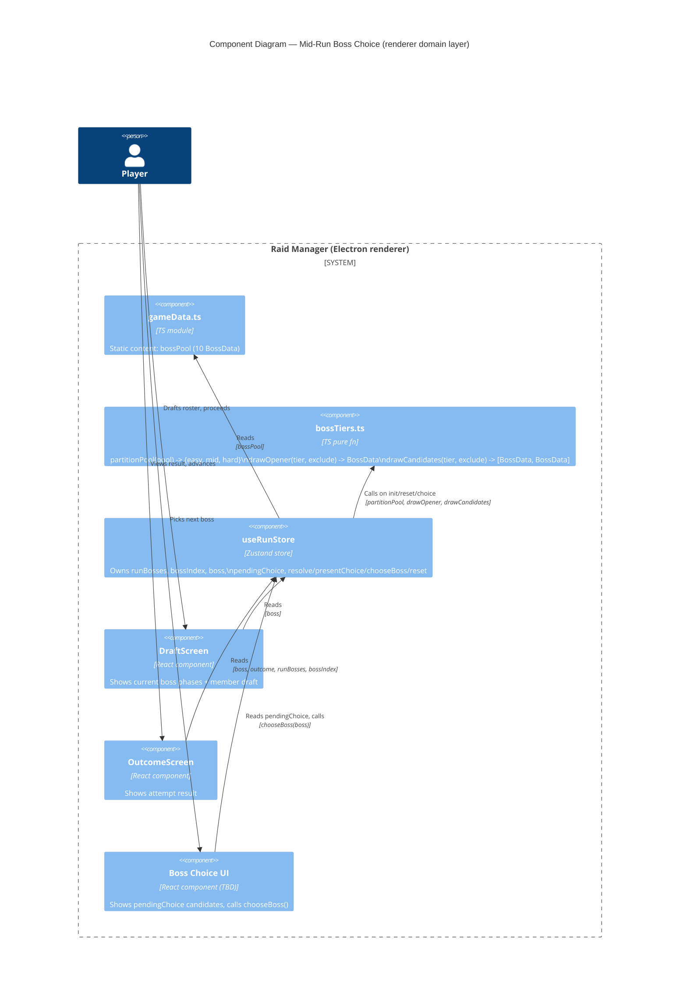

# Architecture: Mid-Run Boss Choice

> **File**: `docs/feature/boss-choice/architecture.md`
> **Ticket / Need**: `boss-choice` (no ticket system; user request)
> **Status**: `approved`

---

<!--
ai_context:
  need: "After defeating boss 1, the player should choose which boss to face next from 2 candidates, instead of the run's 3-boss sequence being fully pre-determined at draft time. Same choice happens again after boss 2 to pick boss 3."
  domain: "Raid Manager — Run / Boss Encounter"
  constraints:
    - "Client-only React/TS/Zustand app (app/src/renderer/src), no backend involved"
    - "Existing BossData/BossPhaseData/LootItemData shapes (boss_v2 spec) must not change"
    - "attemptBoss()/resolve combat math and the effectiveRoster() seam (see tech_debt.md) must not be duplicated or bypassed"
    - "No run-to-run persistence (per boss_v2 non-goals)"
  quality_priorities: ["simplicity", "minimal blast radius on existing run flow"]
  decisions:
    - "No ADR needed — additive change within the existing 'Run / Boss Encounter' context, reversible, no cross-context impact. State machine extension (pendingChoice/presentChoice/chooseBoss) and tiering (bossTiers.ts) left as implementation detail to software-development."
  open_questions:
    - "OQ-1: UI/screen design for the boss-choice step is deferred — user will specify components/screen separately before frontend-development implements it."
  assumptions:
    - "A-1: bossPool (10 bosses) splits cleanly into easy(>=1)/mid(>=2)/hard(>=2) tiers by avg phaseTarget"
    - "A-2: bossName-based exclusion is sufficient (bossPool entries are stable singletons, no duplicate names)"
-->

---

## 1. Need

Today, a run's 3 bosses (`runBosses`) are fully decided at run start: `draftBosses()` picks 3 distinct bosses at random from the 10-boss pool and sorts them ascending by average phase difficulty. The player has zero input on which bosses they face — `bossIndex` just walks the pre-drafted array.

The player wants agency over the run's path. After clearing boss 1, they should be presented with 2 boss candidates and pick which one becomes boss 2. After clearing boss 2, the same happens for boss 3. Boss 1 stays automatic (always an easy one), so every run still opens the same way, but the back half of the run becomes a player-driven choice with real difficulty stakes.

---

## 2. Goals & Non-Goals

### Goals

- [ ] `bossPool` (10 bosses) is partitioned into 3 difficulty tiers — `easy`, `mid`, `hard` — by average `phaseTarget`, sized at least 1/2/2.
- [ ] At run start (and on `reset()`), boss 1 is a single random draw from the `easy` tier (`drawOpener`).
- [ ] After boss 1 resolves (victory, run not over), the run state exposes 2 distinct candidates drawn from the `mid` tier, excluding boss 1 (`drawCandidates`). The player picks one; it becomes boss 2 and is resolved immediately.
- [ ] After boss 2 resolves (victory, run not over), the run state exposes 2 distinct candidates drawn from the `hard` tier, excluding boss 1, boss 2, and the unpicked boss-2 candidate. The player picks one; it becomes boss 3 and is resolved immediately.
- [ ] Across one run, boss 1 + both boss-2 candidates + both boss-3 candidates are 5 distinct bosses — no boss is offered twice.
- [ ] `useRunStore` remains the single source of truth for run progression: `runBosses` now grows incrementally (1 → 2 → 3 entries) as choices are made, rather than being fully populated upfront.

### Non-Goals

- UI/screen design for the choice step — deferred (see OQ-1).
- Changes to phase resolution math, `attemptBoss()`, or the `effectiveRoster()` seam.
- Changes to `BossData`/`BossPhaseData`/`LootItemData` shapes.
- Changes to member draft (`useDraftStore`) or loot (`useLootStore`).
- Cross-run persistence, seeding, or replay of a specific run's choices.
- Boss 1 choice — boss 1 stays fully automatic.

---

## 3. Domain Map

Single existing bounded context — no new context introduced.

| Context | Classification | Owns | Does NOT own |
|---|---|---|---|
| Run / Boss Encounter | Core | Boss pool tiering, boss draws (1 opener + 2x2 candidate pairs), pending boss-choice state, run boss sequence, phase resolution | Member roster/draft (`useDraftStore`), loot (`useLootStore`) |

### Context Relationships

- `Run/BossEncounter → bossPool (gameData)`: Customer/Supplier — the run domain reads the static, tiered boss content; content has no knowledge of the run.
- `Screens → useRunStore`: Conformist — screens read `boss` / `pendingChoice` / `runBosses` / `bossIndex` and call `chooseBoss()`; no independent boss-list or tiering access.

---

## 4. Architectural Decisions Summary

No ADR-level decisions. This is an additive extension of the existing "Run / Boss Encounter" state machine (`useRunStore`), same as the boss-pool-draft precedent. It does not introduce a new bounded context, change a cross-context contract, or make a hard-to-reverse choice.

For continuity with existing run-state ownership (`useRunStore` already owns `bossIndex`/`boss`/`runBosses`/`resolve`/`advance`/`reset`), the new pending-choice state and draw logic are added to the same store and a new sibling pure-logic module (`bossTiers.ts`, alongside `bossDraft.ts`) — covered below as guidance for `software-development`/`frontend-development`, not as a binding ADR.

---

## 5. Thinking Process

### What we started with

A pre-drafted, fixed `runBosses` (length 3, sorted ascending by difficulty) with no player input — `advance()` walks the array and immediately resolves combat against `runBosses[bossIndex + 1]`.

### What we explored

**Topic: Scope of the choice — boss 2 only, or boss 2 and boss 3?**

Initially scoped as "boss 2 only, boss 3 fixed/last". Through iteration this changed: boss 3 is *also* a player choice between 2 system-drawn candidates, mirroring boss 2. Only boss 1 stays fully automatic.

**Topic: Where do candidates come from?**

Rejected "reuse the pre-drafted trio" (the old `draftBosses(pool, 3)` + sort) — it doesn't fit a model where the player's pick changes which boss is "next". Instead, candidates are drawn fresh, on demand, from the pool at the moment they're needed.

**Topic: Preventing repeats across the two choice stages**

The constraint "a boss must not appear in two different draft stages" (boss-2 candidates and boss-3 candidates must be disjoint sets, and disjoint from boss 1) is satisfied structurally by partitioning `bossPool` into three disjoint difficulty tiers up front (easy/mid/hard) and drawing each stage from its own tier. This also reinstates the easy→hard ramp that the old sort-by-difficulty step provided, without needing a sort step after the fact.

**Topic: Boss 1 selection**

Settled on "always an easy one" — a single random draw from the `easy` tier (`drawOpener`), keeping the existing RNG-based approach (`draftBosses`'s shuffle-and-slice pattern) but scoped to a tier instead of the whole pool.

**Topic: Naming of draw functions**

First pass named a function `drawTwo(...) → "boss3 candidates"`, which conflated "the candidates" with "boss 3" itself (boss 3 doesn't exist until the player picks). Renamed to `drawCandidates(tier, exclude): [BossData, BossData]`, used identically for both the boss-2 and boss-3 candidate pairs — no boss-number-specific function names.

**Topic: Where does the new state live?**

Considered a separate `useBossChoiceStore` (mirroring `useDraftStore`'s interactive-selection pattern). Rejected: `chooseBoss()` immediately triggers combat resolution against the picked boss via the existing `attemptBoss()`, so a separate store would need to write back into `useRunStore` anyway — two stores for one transition adds indirection with no isolation benefit. Extended `useRunStore` instead, consistent with how `runBosses` was folded into it during boss-pool-draft.

### What changed during the process

- **Revision**: Scope changed from "boss 2 only gets a choice" to "boss 2 and boss 3 both get a choice, boss 1 stays automatic". This is reflected throughout Sections 1–3 and the diagram.
- **Revision**: Candidate sourcing changed from "reuse pre-drafted trio" to "draw on demand from difficulty-partitioned tiers", which also subsumed the difficulty-ramp requirement (no separate sort step needed).

### What remains open

- OQ-1 — UI/screen design for the choice step (see Section 7).

---

## 6. System Diagram

---

## 7. Open Questions

| ID | Question | Impact if unresolved | Owner | Due |
|---|---|---|---|---|
| OQ-1 | What screen/component shows the 2 boss candidates and captures the pick? | `chooseBoss()` exists in the store but nothing calls it — feature is inert without UI | User (to specify separately) | Before frontend-development on the UI layer |

---

## 8. Assumptions

| ID | Assumption | Consequence if wrong | Validated? |
|---|---|---|---|
| A-1 | `bossPool` (10 bosses) splits cleanly into easy(>=1)/mid(>=2)/hard(>=2) tiers by avg `phaseTarget` | `drawOpener`/`drawCandidates` would have nothing to draw from for an empty/undersized tier | ☐ (verify tier sizes once `partitionPool` is implemented against the real 10-boss pool) |
| A-2 | `bossName`-based exclusion is sufficient (pool entries are stable singletons, no duplicate names) | Exclusion could under/over-match if names collide | ☑ (true today — `draftBosses`/OutcomeScreen already key on `bossName`) |

---

## 9. Follow-up Actions

- [ ] Implement via `frontend-development` (data + logic): add `bossTiers.ts` (`partitionPool`, `drawOpener`, `drawCandidates`); extend `useRunStore` with `pendingChoice`, `presentChoice()`, `chooseBoss()`, and incremental `runBosses` growth.
- [ ] Resolve OQ-1 (boss-choice UI) with the user, then implement the choice screen/component via `frontend-development`.
