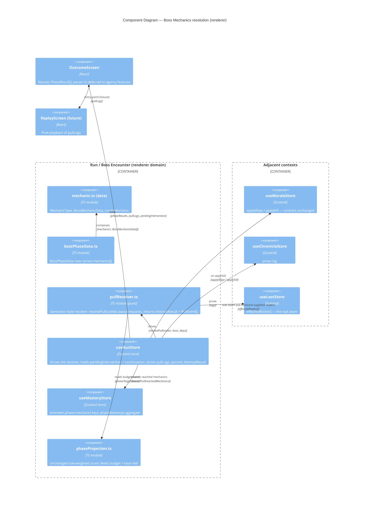

# Architecture — Boss Mechanics

> **File**: `docs/feature/boss-mechanics/architecture.md`
> **Need**: Make boss mechanics first-class data and rewrite pull resolution to
> resolve mechanic-by-mechanic, emitting a structured pull log and exposing a
> pause-point state machine that four sibling agency features build on.
> **Status**: `draft` — design + planning only, no implementation.

---

```yaml
ai_context:
  need: "boss-mechanics"
  domain: "Roguelike raid-management combat resolution (Godot-targeted, currently a React/TS renderer prototype)"
  one_liner: >
    Replace the 3 abstract per-phase pass rolls with named, typed mechanics that
    resolve in order, tallying severity damage against a phase budget, killing on
    lethal failures, emitting a PullEvent log, and pausing between mechanic events
    so heroism/battle-res/call-the-wipe can intervene.

  layer: "renderer (app/src/renderer/src) — frontend only, no Go backend touched"

  constraints:
    - "Balance compatibility is a hard requirement: fresh-roster expected pulls-per-boss and full-mastery pulls-per-boss must stay within tolerance of today's curve. A Monte-Carlo vitest harness asserts this."
    - "RNG is Math.random with no seeding (ADR-001 assumption A-2). Unit tests script Math.random as a sequential queue; the per-mechanic resolution defines a NEW, exact draw order that becomes a contract (heroism re-roll / battle-res override must know which draw they replay)."
    - "All Resolution stat reads must go through useLootStore.effectiveRoster() (tech_debt.md: single-seam rule). The new per-mechanic check reads member[tested]; it must read the effective roster, never raw pool stats."
    - "New-player rule: NO new player verbs in this feature. Depth goes into attribution + presentation. The pause-point machine ships dormant (no trigger registered) until the agency features land."
    - "Pause points must be designed so heroism (budget-fail), battle-res (death), call-the-wipe (>=2 failed checks pre-pass) each register against the SAME machine without those features existing yet."
    - "pull-replay is a hard consumer of the PullEvent / pullLogs shape. pull-intent threads a PullIntent through pull(); resolution signatures must not make that awkward."

  quality_priorities: ["correctness (balance parity)", "extensibility (substrate for 4 features)", "testability (scripted RNG + Monte-Carlo)", "simplicity"]

  decisions:
    - id: "ADR-002"
      title: "Mechanics as ordered phase data replacing mechanicCount"
    - id: "ADR-003"
      title: "Mechanic-by-mechanic resolution with damage budget; exact RNG draw-order contract"
    - id: "ADR-004"
      title: "Pause-point state machine as a resumable generator-driven resolver"
    - id: "ADR-005"
      title: "Per-mechanic mastery keys with phase-aggregate read model"
    - id: "ADR-006"
      title: "PullEvent log emitted inline by the resolver; pullLogs reset per boss"

  open_questions:
    - "OQ-1: Exact value of U0 and per-severity damage and the budget formula — set by the balance harness (ADR-003), not by this design. Design fixes the SHAPE; harness fixes the numbers."
    - "OQ-2: Should ADD_WAVE / DODGE / RAIDWIDE differ mechanically, or are MechanicType differences purely cosmetic (targets/severity/glyph) in v1? Design assumes cosmetic-only; behaviour is fully captured by (tested, targets, severity)."
    - "OQ-3: pull-intent's Safety/Practice modifiers (lethality halved, pass malus, mastery x1.5) — boss-mechanics removes the single 'pass roll' those modifiers hooked. Mapping is sketched (see ADR-003 'pull-intent compatibility'), confirmed only when pull-intent lands."

  assumptions:
    - "A-1: MechanicType behavioural differences are out of scope (OQ-2). A mechanic is fully described by (tested, targets, severity); type drives only authoring defaults, chronicle/replay glyphs, and arena choreography (a pull-replay concern)."
    - "A-2 (inherited from ADR-001): Math.random with no seeding is sufficient; determinism in tests comes from mocking, not seeding."
    - "A-3: A boss still has exactly 3 phases. This feature does not generalise phase count."
```

---

## 1. Bounded context

This feature lives entirely in the **Run / Boss Encounter** context (the
`app/src/renderer/src/domain` slice). No Go backend, no cross-context contract
beyond the ones already in place:

| Context | Relationship here | Notes |
|---|---|---|
| **Boss Encounter** (Resolution) | Core — owns the rewrite | `useRunStore` resolver, `bossPhaseData`, new `mechanic` module |
| **Mastery** | Partnership | rekeyed to (member, phase, mechanic); resolver records per reached mechanic |
| **Morale** | Customer/Supplier (Resolution = customer) | `applyWipe(phaseIndex, blunderer, roster)` contract is UNCHANGED; resolver still supplies a phase index + optional blamed member |
| **Chronicle** | Customer/Supplier | resolver logs prose; no new `ChronicleKind` needed (`'battle'` / `'morale'` suffice) |
| **Loot** | Conformist | resolver keeps reading via `effectiveRoster()`; the single-seam rule (tech_debt) extends to the new per-mechanic check |
| **Pull Replay** (future) | Open Host Service — Resolution publishes `PullEvent[]` | `pullLogs` is the published language; replay is pure playback |

The key architectural move: **Resolution stops being a pure function that runs
to completion and becomes a resumable state machine.** That is the substrate the
four agency features ride. Everything else (data model, mastery, log) is
supporting work that makes that machine emit the right events.

---

## 2. Component view (C4 Level 3 — inside the renderer's Run context)



---

## 3. Decision summary

| # | Decision | ADR |
|---|---|---|
| 1 | `mechanics: BossMechanicData[]` on the phase replaces `mechanicCount`; `createMechanic` with per-type defaults | [ADR-002](../../adr/ADR-002-mechanics-as-phase-data.md) |
| 2 | Resolution becomes mechanic-by-mechanic: per-targeted-member check, severity tally vs budget, death->wipe, budget-exceeded->wipe. Exact RNG draw order is a frozen contract. | [ADR-003](../../adr/ADR-003-mechanic-resolution-and-rng-contract.md) |
| 3 | The pause-point machine is a **resumable resolver** (generator yielding pause requests); `useRunStore` holds the suspended continuation + `pendingIntervention`. Ships dormant. | [ADR-004](../../adr/ADR-004-pause-point-state-machine.md) |
| 4 | Mastery rekeyed to (member, phase, mechanic); +1 step on reach, +2 if Discipline>=4; phase mastery = average over its mechanics. | [ADR-005](../../adr/ADR-005-per-mechanic-mastery.md) |
| 5 | The resolver emits `PullEvent[]` inline at named points; `useRunStore.pullLogs: PullEvent[][]` resets per boss. | [ADR-006](../../adr/ADR-006-pull-event-log.md) |

---

## 4. The pause-point contract (the load-bearing part)

The four agency features each need to: (a) **observe** the resolution at a named
moment, (b) **decide** whether to interrupt, (c) **alter** the in-flight result,
(d) **resume**. They must do this without boss-mechanics knowing they exist.

The design (ADR-004) models resolution as a **generator** that yields a
`PausePoint` at three named hooks and is resumed by the store with a
`Resolution` instruction:

```
resolvePull() ──yield──> PausePoint{ kind, ctx }
                           │
        useRunStore decides if any registered trigger fires
                           │
   no trigger ─────────────┤ store resumes with { action: 'continue' }
   trigger fires ──────────┤ store sets pendingIntervention, freezes
                           │ player chooses (future UI) → store resumes with
                           │ { action: 'reroll' | 'override' | 'wipe' | 'continue' }
                           ▼
              generator applies instruction, continues
```

The three hook kinds are fixed by this feature so the future features slot in
without changing the resolver:

| Hook kind | Fires after | Future consumer | Resume instructions it uses |
|---|---|---|---|
| `pre-pass` *(legacy-compat name; here = "phase checks complete, pre-resolve")* | a phase's per-mechanic checks tallied, before the phase verdict | **call-the-wipe** (>=2 failed checks) | `wipe('called')` \| `continue` |
| `on-death` | a severity-3 check kills a member | **battle-res** | `override` (cancel the death, continue phase) \| `continue` (accept wipe) |
| `on-budget-fail` | the phase verdict is a budget-exceeded learning wipe | **heroism** | `reroll` (re-roll the budget verdict once) \| `continue` |

boss-mechanics ships the machine with **zero triggers registered**, so every
yield is auto-resumed with `continue` and resolution behaves atomically — the
existing OutcomeScreen reveal is unchanged. Each agency feature later registers
its trigger predicate + resume options; none of them re-touch the resolver.

> Naming note: heroism's spec calls hook 1 "post-fumble-checks-pre-pass-roll".
> In the mechanic model there is no single pass roll; the equivalent moment is
> "all of a phase's mechanic checks are tallied, before the phase verdict is
> emitted". We keep the spec's three hook *intents* and map them onto the new
> flow; ADR-004 fixes the exact hook positions.

---

## 5. Scalability / reliability checklist (scoped)

This is a single-process client simulation; the usual distributed concerns are
N/A. The relevant risks are determinism and balance:

- **RNG determinism (tests)** — every new draw is enumerated in ADR-003 so
  scripted-roll specs and seeded e2e stay authorable. The pause machine, when a
  trigger eventually consumes an extra draw (heroism re-roll), inserts it at a
  defined position; ADR-004 pins where.
- **Balance parity** — the Monte-Carlo harness (ADR-003 §harness) is the safety
  net; it fails CI if pulls-per-boss drifts outside tolerance after the rewrite.
- **Single stat seam** — the per-mechanic check is a *new* stat-read site;
  tech_debt's single-seam rule is extended: the resolver receives an
  already-effective roster from the store (built via `effectiveRoster()`), and
  never reads raw `member.skill/discipline` itself.
- **No new SPOF, no async, no persistence change** — `pullLogs` lives in run
  state alongside `phaseResults`; reset semantics mirror it (per boss).

---

## 6. Thinking process / what was explored

- **Why a generator, not a step-list of callbacks?** The agency features need to
  *alter* the in-flight result (override a death, re-roll a verdict), not just
  observe it. A pure observer/event-bus can't do that. A generator that yields
  control and receives an instruction is the smallest construct that lets the
  store drive interruption + mutation while the resolver keeps all its local
  state on the stack — no half-built result object to thread through. KISS won
  over a hand-rolled explicit state-machine enum, which would have to
  externalise every local (current phase index, running tally, mechanic
  cursor). See ADR-004 alternatives.
- **Why fix the three hooks now, dormant?** YAGNI says don't build the agency
  features. But the spec's whole sequencing argument is that the *hooks* are the
  expensive, hard-to-retrofit part. Landing three well-placed yield points with
  a no-op driver is cheap and is exactly the substrate the three features were
  going to build anyway — building it here avoids three separate resolver
  rewrites. This is the one place we deliberately build slightly ahead of need,
  and it's justified by an explicit cross-feature dependency, not speculation.
- **Why keep `applyWipe`/`projectPhase`/morale untouched?** Minimal-impact. The
  phase still has a `phaseIndex`, still can name a blamed member, still feeds a
  role-weighted score. Budget reuses `phaseTarget`. The rewrite is contained to
  "how a phase verdict is reached", not "what a phase verdict means downstream".
- **Why per-mechanic mastery as storage but phase-average as the read model?**
  The S-curve the old hand-banded `masteryGain` produced now *emerges*: a 5-
  mechanic phase needs 5 reaches to fill, a 2-mechanic phase fills in 2. The
  read model stays phase-level so projection/bands/bars and the budget feel are
  unchanged. See ADR-005.

---

## 7. Out of scope (explicit deferrals)

- Heroism / Battle-Res / Call-the-Wipe behaviour and UI — only their **hook
  points and resume vocabulary** are designed here; their triggers ship later.
- Pull-Replay rendering — only the `PullEvent` **shape and emission points** are
  fixed here.
- Pull-Intent stance modifiers — sketched for compatibility (ADR-003), not built.
- MechanicType behavioural differentiation (OQ-2) — cosmetic-only in v1.
- Arena choreography, `'save'` event kind — pull-replay stage 4 concerns.

---

## Related

- ADRs: [ADR-002](../../adr/ADR-002-mechanics-as-phase-data.md),
  [ADR-003](../../adr/ADR-003-mechanic-resolution-and-rng-contract.md),
  [ADR-004](../../adr/ADR-004-pause-point-state-machine.md),
  [ADR-005](../../adr/ADR-005-per-mechanic-mastery.md),
  [ADR-006](../../adr/ADR-006-pull-event-log.md)
- Tech breakdown: [tech-breakdown.md](./tech-breakdown.md)
- Spec: [todo.md](./todo.md)
- Prior art: [ADR-001](../../adr/ADR-001-tied-phase-rolelock-runtime-roll.md) (RNG/no-seeding assumption, single resolution point pattern)
```
