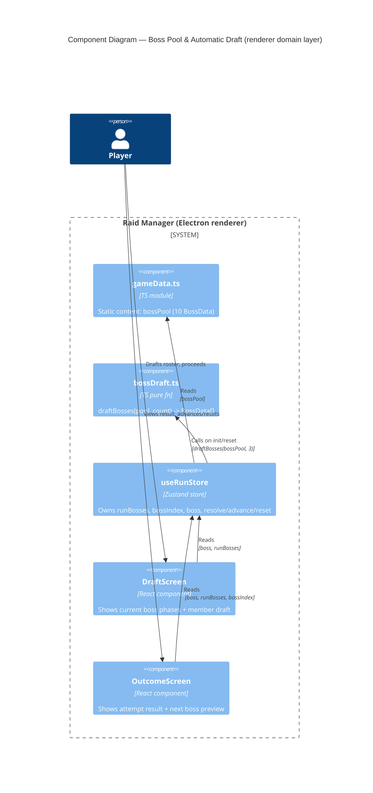

# Architecture: Boss Pool & Automatic Draft

> **File**: `docs/feature/boss-pool-draft/architecture.md`
> **Ticket / Need**: `boss-pool-draft` (no ticket system; user request)
> **Status**: `approved`

---

<!--
ai_context:
  need: "Expand boss roster from 3 hardcoded bosses to a pool of 10, and automatically draft 3 per run instead of always running the same fixed sequence."
  domain: "Raid Manager — Run / Boss Encounter"
  constraints:
    - "Client-only React/TS/Zustand app (app/src/renderer/src), no backend involved"
    - "Existing BossData/BossPhaseData/LootItemData shapes (boss_v2 spec) must not change"
    - "No run-to-run persistence (per boss_v2 non-goals)"
  quality_priorities: ["simplicity", "minimal blast radius on existing run flow"]
  decisions:
    - "No ADR needed — additive change within a single existing bounded context, reversible, no cross-team or cross-context impact. Implementation detail (runBosses field, draftBosses() fn) left to software-development."
  open_questions: []
  assumptions:
    - "Repeats across different runs are fine (no persistence requirement)"
    - "Repeats within the same run's 3-boss draft are NOT allowed"
-->

---

## 1. Need

The run currently always fights the same 3 hardcoded bosses in the same order (`bosses[0..2]` in `gameData.ts`). The user wants more variety: a pool of 10 bosses (3 existing + 7 new), with each run automatically drafting 3 distinct bosses from that pool — no player choice involved. This keeps the existing 3-boss run structure (Draft → Attempt → Outcome → Advance ×2 → Outcome) but varies which bosses appear and in what order.

---

## 2. Goals & Non-Goals

### Goals

- [ ] `gameData.ts` exposes a `bossPool: BossData[]` of exactly 10 bosses (existing 3 + 7 new), each following the existing `BossData`/`BossPhaseData`/`LootItemData` shapes.
- [ ] At run start (store init and on `reset()`), 3 distinct bosses are drawn at random from `bossPool` and ordered ascending by average phase target (easiest → hardest), forming `runBosses`.
- [ ] `useRunStore` is the single source of truth for the active run's boss sequence; `DraftScreen` and `OutcomeScreen` no longer import the global boss list directly for run content.

### Non-Goals

- Player-facing boss selection / banning (still automatic, per existing spec).
- Cross-run persistence, seeding, or replay of a specific draft.
- Changes to the phase resolution formula, outcome states, or BossData/BossPhaseData/LootItemData shapes.
- Difficulty rebalancing of the existing 3 bosses.

---

## 3. Domain Map

Single existing bounded context — no new context introduced.

| Context | Classification | Owns | Does NOT own |
|---|---|---|---|
| Run / Boss Encounter | Core | Boss pool data, draft selection, run boss sequence, phase resolution | Member roster/draft (separate `useDraftStore`), loot (`useLootStore`) |

### Context Relationships

- `Run/BossEncounter → bossPool (gameData)`: Customer/Supplier — the run domain consumes the static boss content; content has no knowledge of the run.
- `DraftScreen / OutcomeScreen → useRunStore`: Conformist — screens read `boss` / `runBosses` / `bossIndex` from the store; no independent boss-list access.

---

## 4. Architectural Decisions Summary

No ADR-level decisions. This is an additive change within the existing "Run / Boss Encounter" bounded context: same module (`gameData.ts`), same store (`useRunStore`), same screens. It does not introduce a new context, change a contract between contexts, or make a hard-to-reverse choice — so it stays an implementation detail for `software-development`/`frontend-development`.

For continuity with the existing run-state ownership (`useRunStore` already owns `bossIndex`/`boss`/`resolve`/`advance`/`reset`), the drafted 3-boss sequence (`runBosses`) is added to that same store rather than a new one — covered below as guidance, not as a binding ADR.

---

## 5. Thinking Process

### What we started with

A static `bosses: BossData[]` (length 3) in `gameData.ts`, consumed directly by `useRunStore` (sequential progression via `bossIndex`), `DraftScreen` (`bosses[0]` for phase preview), and `OutcomeScreen` (`bosses[bossIndex + 1]` for "next boss" preview).

### What we explored

**Topic: Where does the drafted 3-boss sequence live?**

Two options: (a) a new dedicated store for the boss draft, or (b) a field on the existing `useRunStore`, which already owns `bossIndex`, `boss`, and `reset()`. A separate store would mirror the `useDraftStore` (member draft) pattern, but a member draft is a multi-round interactive process with its own UI state — the boss draft is a single, instantaneous, non-interactive selection at run start. Adding a store for a 3-element array introduces a second source of truth for "which bosses are in this run" and an extra cross-store read for every screen that needs `runBosses`. Folding it into `useRunStore` keeps run-sequence state in one place.

**Topic: Draft ordering / difficulty curve**

User chose: sort the 3 drafted bosses ascending by average phase target (mean of `phaseTarget` across the boss's 3 phases), so each run has a soft difficulty ramp. This requires no new boss property — `phaseTarget` already exists on `BossPhaseData`.

**Topic: Repeats**

Within one run's draft of 3, bosses must be distinct (sampling without replacement from the 10-pool). Across different runs, repeats are expected and fine — there's no persistence layer to track history, consistent with the boss_v2 non-goals (no progression between runs).

### What changed during the process

Initially considered writing this up as an ADR (store ownership of `runBosses`), but it's a same-context, reversible, implementation-level choice — not a structural decision. Folded into guidance for the implementation tickets instead.

### What remains open

None.

---

## 6. System Diagram

---

## 7. Open Questions

None.

---

## 8. Assumptions

| ID | Assumption | Consequence if wrong | Validated? |
|---|---|---|---|
| A-1 | Repeats across different runs (not within one run) are acceptable | Would need a cross-run history mechanism | ☑ (confirmed — matches boss_v2 non-goals) |
| A-2 | "Difficulty" can be approximated by average `phaseTarget` across a boss's 3 phases | Sort order may not always match perceived difficulty (weights also matter) | ☐ (acceptable simple proxy for MVP) |

---

## 9. Follow-up Actions

- [ ] Implement via `frontend-development` (data + store wiring): add 7 bosses to `bossPool`, implement `draftBosses()`, wire `runBosses` into `useRunStore`
- [ ] Implement via `frontend-development` (screens): update `DraftScreen`/`OutcomeScreen` to read `boss`/`runBosses` from `useRunStore` instead of the global boss list
