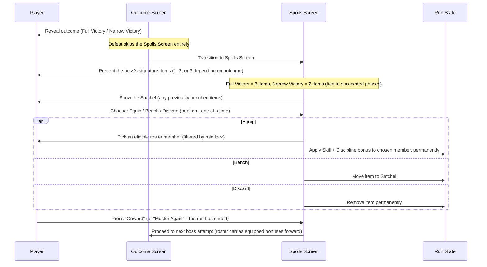

# Game Design — Signature Loot

## Summary

After each boss attempt that ends in **Full Victory** or **Narrow Victory**, the boss drops **signature items** — pieces of loot thematically tied to that boss's identity and phases. Each boss has exactly **3 signature items, one per phase**, and the number that actually drop depends on the outcome: a Full Victory yields all 3, a Narrow Victory yields only the 2 tied to the phases that succeeded, and a Defeat yields nothing. The player may **equip each item on a roster member, bench it for later, or discard it**. Equipped items grant small, permanent, strictly-positive boosts to both **Skill and Discipline**, stacking gradually across the gauntlet's up to 15 bosses. Loot is **role-locked**: each item can only be equipped by members of a specific role (Tank, Heal, or DPS), reflecting the phase it's derived from.

This system turns "what do we do with the spoils" into a recurring, low-friction decision point that compounds roster strength over a run without ever introducing a downside or a forced choice — and ties the *quality* of a victory (full vs. narrow) directly to the *quantity* of spoils it leaves behind.

---

## Why We Are Building This

Right now, defeating a boss in the gauntlet only opens the door to the next fight — there is no lasting reward, no sense of the roster growing stronger, and no reason to care about *how* a boss was beaten beyond "did we survive." Signature loot gives victories a tangible, persistent payoff: each win leaves a mark on the roster, nudging members' Skill and Discipline upward in small steps that echo the boss's identity. Because loot is tied to each boss's phases and theme (Direction C, now applied per-phase), the rewards also reinforce the gauntlet's narrative — beating "The Rot Unending" should *feel* different from beating "The Endless Dusk," and the loot each leaves behind should say so. Deriving one item per phase, and gating drops on which phases actually succeeded, also makes the **Narrow Victory** outcome feel meaningfully different from a Full Victory beyond just "you didn't fail" — it's "you fought through two of three trials, and the spoils show it."

---

## Goals

- Give every Full Victory and Narrow Victory a persistent, positive payoff for the roster
- Tie each boss's loot thematically to its phases and identity, with **one item per phase** (signature loot, Direction C, applied per-phase)
- Make the difference between Full Victory and Narrow Victory tangible in the spoils: more succeeded phases → more loot
- Keep stat growth small and steady so it "drips" across up to 15 bosses without trivializing late-game phase targets
- Let the player freely accept, bench, or discard loot — never force an assignment
- Use role-locking to make loot decisions meaningful relative to the fixed 8-member roster (2 Tank / 2 Heal / 4 DPS)

## Non-Goals

- No double-edged items — there is no "Skill up / Discipline down" tradeoff; every item improves both stats
- No relationship, morale, or inter-member hooks of any kind
- No item rarity tiers, sets, upgrades, or crafting systems (out of scope for this iteration)
- No loot from Defeat outcomes — a defeated attempt yields nothing, not even a consolation prize
- No re-drafting or roster changes triggered by loot — the 8 members chosen at the draft remain fixed for the run
- **No randomization within a boss's drop, with one narrow, explicit exception**: when a phase's role weights are perfectly tied (no single highest-weight role), a per-boss authored weighting is rolled to decide which role that phase's item locks to. This is the *only* place randomness enters the loot system — it never affects *whether* an item drops, *how many* items drop, or *which phases* they're tied to (all of that remains fully deterministic from the outcome). It only ever resolves *which role* a tied phase's item is locked to. See "Signature Loot Mapping" below.

---

## Data Model

### Item

| Property      | Type   | Description                                                            |
|---------------|--------|--------------------------------------------------------------------------|
| Name          | string | Display name, thematically tied to the dropping boss and phase        |
| Flavor        | string | One-line description linking the item to the boss's identity/phase    |
| Source Boss   | string | Name of the boss this item is signature loot for                      |
| Source Phase  | int    | Index (0-2) of the phase this item is derived from                     |
| Role Lock     | enum   | Tank / Heal / DPS — only members of this role can equip the item      |
| Skill Bonus   | int    | Flat permanent bonus added to the wearer's Skill (always positive)    |
| Discipline Bonus | int  | Flat permanent bonus added to the wearer's Discipline (always positive)|

### Loot Table (per boss)

Each boss in the gauntlet defines exactly **3 signature items** — `signatureItems: LootItemData[3]`, ordered by phase index (0, 1, 2) — generated from each phase's role-weight makeup (see "Signature Loot Mapping" below). Aside from the one narrow tie-break exception described above, there is no randomization within a boss's drop — all 3 items are hardcoded per boss, just like phases are.

### Drop Count by Outcome

The number of items that actually drop from `signatureItems` depends on the attempt's outcome:

| Outcome | Condition | Items dropped |
|---------|-----------|----------------|
| Full Victory | one-shot kill (all 3 phases, pull 1) | All 3 items (`signatureItems[0..2]`) |
| Narrow Victory | kill after one or more wipes | 2 of the 3 items — one random item is lost to the grind |
| Wipe / Disband | a phase failed / a member gquit | None |

Since the wipe-loop rework (see [morale](morale/todo.md)), a kill always means all 3 phases passed — the Full/Narrow split rewards the *one-shot*, and a ground-out kill loses one random item.

### Roster Loot State

| Property        | Type        | Description                                                        |
|-----------------|-------------|--------------------------------------------------------------------|
| Equipped Items  | map(member → item[]) | Items currently worn by each member; stat bonuses are active |
| Bench           | item[]      | Items the player declined to assign immediately, kept for later    |
| Discarded       | item[]      | Items the player chose to discard; gone for the rest of the run    |

---

## Rules & Constraints

- An item can only be equipped by a member whose Role matches the item's Role Lock
- Stat bonuses from equipped items are additive and permanent for the remainder of the run (they do not expire, degrade, or get removed once equipped)
- A member may equip multiple items over the course of a run; bonuses stack
- There is no equip-slot cap — the limiting factor is simply how much loot the gauntlet produces (at most 45 items total across a 15-boss run, 3 per boss, fewer on Narrow Victories and none on Defeats)
- Benched items remain available for assignment after any subsequent boss's loot moment, for the rest of the run
- Discarded items are gone permanently — they cannot be recovered or re-offered
- Loot only drops on a kill (Full or Narrow Victory); wipes and disbands yield nothing
- On Narrow Victory, one random item of the 3 is lost — it does not drop, is not shown, and cannot be obtained later
- A loot grant also restores the recipient's morale: +2 for a rare (signature) item, +1 for a common — see [morale](morale/todo.md)
- All stat bonuses respect the 0-5 scale: a bonus that would push a stat above 5 is clamped at 5
- Items are never generated at runtime — each boss's 3 signature items are hardcoded, consistent with the rest of the game's data model, with the single exception of the tied-phase role-lock roll described below

---

## Rarity

| Rarity | Source | Bonus | Effect |
|---|---|---|---|
| **Common** | Camp [skirmishes](camp.md) (roadside warbands) | +1 to a **single** stat | none |
| **Rare** | Boss signature drops (this document) | +1 Skill **and** +1 Discipline | phase two: one-line effect (not yet implemented) |

- `Item.rarity` is `common` or `rare`; every signature item is rare
- Commons are generic road-loot (a whetstone, a drill whistle…) — role-locked like all
  loot, but not tied to any boss or phase
- Commons go through the same equip / bench / discard flow and trigger personality
  reactions exactly like rares

## Item Magnitude & Curve

**Goal:** small, frequent deltas that drip steadily across up to 15 bosses, building a noticeable but not trivializing edge by the gauntlet's later, harder phases.

- Each item grants **+1 to Skill and +1 to Discipline** to its wearer — a flat, modest, dual-stat boost
- On the 1-5 stat scale, +1 is a meaningful step (one full pip); all items share the same magnitude regardless of gauntlet position
- **All 3 of a boss's signature items grant the same bonus** — only the Role Lock and flavor differ between them

| Gauntlet position   | Bosses (approx.) | Signature item bonus (all 3 items) |
|---------------------|------------------|--------------------------------------|
| Entire gauntlet     | Bosses 1–15      | +1 Skill / +1 Discipline |

**Why this works:**

- A Full Victory against a single boss grants up to 3 items (+1/+1 each) — but spread across up to 3 different roles, so no single member benefits 3x. A Narrow Victory grants 2.
- A member who equips a handful of items over a run nets a meaningful but not run-defining boost — one pip visibly shifts their contribution to a role average without single-handedly guaranteeing late-phase success
- The clamp at 5 acts as a hard ceiling: a member at 5 in a stat simply stops gaining further benefit, rather than breaking the phase-success math
- **Tuning flag**: if playtesting shows roster stats inflate too quickly (especially with multiple Full Victories in a row), the first lever to pull is making items single-stat instead of dual-stat, not the per-phase structure itself.

## Role Locking

Loot is **role-locked**, not freely assignable across the whole roster. Each item names exactly one of the three existing roles:

| Role  | Who can equip          | Thematic framing examples                                  |
|-------|------------------------|-------------------------------------------------------------|
| Tank  | Either of the 2 Tanks  | Wardstone shields, bulwark plating, anchor-chains           |
| Heal  | Either of the 2 Heals  | Reliquary censers, communion vials, ward-singing chimes     |
| DPS   | Any of the 4 DPS       | Edge-etched blades, venom phials, star-forged arrowheads    |

This mirrors the fixed 8-member roster shape (2 Tank / 2 Heal / 4 DPS) and ensures loot decisions stay grounded in "which of my Tanks (or Heals, or DPS) benefits most" rather than an open free-for-all. Because DPS has twice the slots of the other two roles, DPS-locked loot naturally has more potential recipients — this is intentional and mirrors the roster's own DPS-heavy shape.

With 3 items per boss instead of 1, a single Full Victory can now plausibly touch **all three roles at once** — e.g., a DPS item from Phase 1, a Tank item from Phase 2, and a Heal item from Phase 3. This is a deliberate improvement over the single-item model, where most bosses' drops favored whichever role happened to dominate the *whole* fight (skewing heavily DPS, since opening phases are almost always DPS-dominant). Per-phase derivation naturally diversifies which roles get rewarded, boss to boss and phase to phase.

---

## Signature Loot Mapping (Direction C, Per-Phase)

Each boss's 3 signature items are derived **per phase**, using the same "highest-weight role" logic that previously ran once per boss — now run once per phase. The mapping rule, applied independently to each of the boss's 3 phases:

1. Look at the phase's three role weights (DPS / Tank / Heal). Identify the role with the **single highest weight** in that phase — that role becomes the item's **Role Lock**, since it's the role most tested by that specific phase.
2. Derive the item's **name and flavor** from the boss's epithet and that specific phase's name/description — so a Phase 1 item evokes the opening of the fight, a Phase 2 item evokes its middle trial, and a Phase 3 item evokes its climax.
3. **Tie-break for tied phases**: if two or three roles share the phase's highest weight (e.g., 2/2/2 or 3/3/3, or a 2-way tie like 1/3/3), there is no single highest-weight role to derive the lock from. In this case — and *only* this case — the Role Lock is resolved via a **random roll weighted per boss**, authored individually for flavor. Each boss with one or more tied phases gets a bespoke weighting (e.g., "this boss's tied phase leans 50% Tank / 30% Heal / 20% DPS, because the phase's narrative is about enduring rather than striking"), rather than a uniform 1/3 split or a fixed global priority order (DPS-first, etc.). This roll happens once, at data-authoring time, and the resulting Role Lock is then fixed for that item — it does not re-roll per run. The roll is the *only* source of randomness in the loot system; everything else (which items exist, their flavor, their magnitude, and how many drop) remains fully deterministic.

This keeps loot legible: a phase that leaned hardest on Tanks leaves behind something a Tank would want to wear, reinforcing "this is the trial that tested our Tanks" — while still giving every boss's tied phases a distinct, authored personality rather than a mechanical coin-flip.

### Tied phases in the current 10-boss gauntlet

Scanning all 10 bosses' phase weights, most phases resolve to a single highest-weight role without any tie-break. A handful of phases — concentrated in Phase 2 (the "trial" phase, often built around contested role weights) and Phase 3 (the "climax" phase, often built to test the whole roster evenly) — come out tied and need an authored weighting. The 4 bosses called out below each have at least one tied Phase 3 (a 2/2/2 or 3/3/3 spread), and some also have a tied Phase 2:

| Boss | Tied phase(s) | Authored weighting | Why |
|------|----------------|----------------------|-----|
| Moloch the Unbound | Phase 2 (1/3/3, Tank-Heal tied); Phase 3 (2/2/2, all tied) | P2 leans **Tank 60% / Heal 40%**. P3 leans **Heal 50% / DPS 25% / Tank 25%** | P2 ("The Branding Rite") is about molten chains *claiming* the careless — a Tank "holds the line" against being claimed. P3 ("The Last Smelting") is framed around endurance ("the weary will not last alone") — a Heal-flavored close to the fight |
| Nyxessa, Empress of the Hollow Stars | Phase 2 (2/3/3, Tank-Heal tied); Phase 3 (3/3/3, all tied) | P2 leans **Tank 60% / Heal 40%**. P3 leans **DPS 45% / Tank 30% / Heal 25%** | P2 ("The Devouring Hush") is about being unmade by silence — enduring annihilation is a Tank framing. P3 ("Collapse of the Final Star") is the kill shot on a dying star — a DPS-flavored climax |
| Vrokhar, the Frostbound Warden | Phase 3 (2/2/2, all tied) | P3 leans **Tank 50% / Heal 30% / DPS 20%** | P3 ("The Last Thaw") is framed as "hold until it melts" — "hold" is a Tank verb, and reinforces Vrokhar's overall Warden/Tank identity (his Phase 1 item is already Tank-locked) |
| The Hollow Author | Phase 3 (3/3/3, all tied) | P3 leans **Heal 45% / Tank 30% / DPS 25%** | P3 ("The Final Sentence") is framed around survival ("survive it, and the story is yours") — a Heal-flavored framing that echoes the boss's existing Heal-locked item |

*(Two additional tied phases exist outside this 4-boss list — The Sundered Titan's Phase 2 (1/3/3, Tank-Heal tied) and Phase 3 (3/3/2, DPS-Tank tied) — and will receive their own authored weightings during implementation, following the same approach.)*

This mapping is mechanical and repeatable: as new bosses are added to the gauntlet (up to 15), each one's 3 signature items follow the same per-phase derivation, with tie-breaks authored individually only where a phase's weights don't produce a clear winner.

### Worked examples (current gauntlet)

#### Moloch the Unbound — fully worked

| Phase | Weights (DPS/Tank/Heal) | Role Lock | Signature item |
|-------|---------------------------|-----------|------------------|
| 1 — The Searing March | 3/1/1 → DPS (clear) | DPS | **Iron Inferno Brand** *(existing)* — a fragment of Moloch's forge-chains, etched with the heat that broke the careless |
| 2 — The Branding Rite | 1/3/3 → tied, authored 60% Tank / 40% Heal → **Tank** | Tank | **Brand-Scarred Manacle** *(new)* — a length of chain that once sought the careless; worn now, it seeks nothing but holds everything |
| 3 — The Last Smelting | 2/2/2 → tied, authored 50% Heal / 25% DPS / 25% Tank → **Heal** | Heal | **Embered Patience** *(new)* — a coal that never cools, carried by those who learned the weary do not last alone |

#### Sythara the Plaguebound — fully worked

| Phase | Weights (DPS/Tank/Heal) | Role Lock | Signature item |
|-------|---------------------------|-----------|------------------|
| 1 — The Withering Approach | 3/1/1 → DPS (clear) | DPS | **Spore-Touched Fang** *(new)* — a tooth coated in Sythara's first breath of rot; it bites once, and the wound never quite heals clean |
| 2 — Communion of Decay | 1/2/3 → Heal (clear) | Heal | **Vial of the Withering Bloom** *(existing)* — a sealed dose of Sythara's own rot, refined into something that steadies rather than spreads |
| 3 — The Last Bloom | 2/3/2 → Tank (clear) | Tank | **Rootbound Carapace** *(new)* — bark-like plating grown from the last bloom, hard enough to hold the line until the rot withers on its own |

#### Nyxessa, Empress of the Hollow Stars — additional example

| Phase | Weights (DPS/Tank/Heal) | Role Lock | Signature item |
|-------|---------------------------|-----------|------------------|
| 1 — The Starless Descent | 4/1/1 → DPS (clear) | DPS | **Hollow Star Shard** *(existing)* — a splinter of Nyxessa's collapsed light, sharp enough to cut even in total darkness |
| 2 — The Devouring Hush | 2/3/3 → tied, authored 60% Tank / 40% Heal → **Tank** | Tank | **Silence-Worn Aegis** *(new)* — a shield that has absorbed a sound it will never give back |
| 3 — Collapse of the Final Star | 3/3/3 → tied, authored 45% DPS / 30% Tank / 25% Heal → **DPS** | DPS | **Last Light, Caught** *(new)* — a weapon that carries one final flare of Nyxessa's dying star, spent the instant it's needed most |

#### Vrokhar, the Frostbound Warden — additional example

| Phase | Weights (DPS/Tank/Heal) | Role Lock | Signature item |
|-------|---------------------------|-----------|------------------|
| 1 — The Shattering Approach | 3/1/1 → DPS (clear) | DPS | **Shardbreaker Point** *(new)* — a weapon-tip that has already cracked through one wall of ice; the next is easier |
| 2 — Wardens of the Frozen Oath | 1/3/2 → Tank (clear) | Tank | **Frozen Oathguard** *(existing)* — a shield of unmelting ice, etched with a vow Vrokhar's wardens kept past death |
| 3 — The Last Thaw | 2/2/2 → tied, authored 50% Tank / 30% Heal / 20% DPS → **Tank** | Tank | **Vigil's Final Frost** *(new)* — the last cold Vrokhar surrendered, held now by those who hold the line until it melts |

*(Note: Vrokhar's existing item, Frozen Oathguard, was previously the boss's single signature item derived from "the highest-weight role across the whole fight." Under per-phase derivation it now anchors specifically to Phase 2, which independently resolves to Tank — so the existing item slots in unchanged.)*

The remaining 6 bosses' items (Zaelith, Karthus, Grizzelmaw, The Hollow Author, Countess Mireth, The Sundered Titan) follow the exact same mechanical derivation — each phase's highest-weight role becomes that item's Role Lock (with authored tie-break weightings for The Hollow Author's Phase 3 and The Sundered Titan's Phase 2/3, as noted above) — and will be authored during implementation.

---

## The Skip / Bench Mechanic

The player is never forced to assign loot immediately. After a boss drop, for **each item that dropped** (1, 2, or 3 depending on the outcome), three choices are available:

1. **Equip now** — assign the item to one eligible member (matching its Role Lock) on the spot; the bonus applies immediately and persists for the rest of the run
2. **Bench it** — set the item aside without assigning it; it moves to a persistent **Satchel** that remains accessible at every subsequent loot moment for the rest of the run
3. **Discard it** — permanently remove the item from the run; it cannot be recovered

Benched items are not lost — they simply wait. At the *next* boss's loot moment (and every one after that), the player sees both the newly-dropped item(s) and the full contents of their Satchel, and may equip any of them (subject to role-lock) or continue benching/discarding. This means a player who, say, wants to wait until they've seen more of the gauntlet before committing a Heal-locked item to one of their two Heals can do so freely — the option doesn't expire.

There is no penalty for benching and no limit on Satchel size (bounded naturally by the at-most-45 total items in a run — 3 per boss across 15 bosses, fewer on Narrow Victories).

---

## UI Flow — The Spoils Moment

Loot assignment happens on a dedicated beat **between the outcome reveal and the "Onward" transition**, so it reads as a natural consequence of victory rather than an interruption.

**Moment-by-moment:**

1. The outcome reveal plays out exactly as today (phase-by-phase reveal, then the outcome banner)
2. If the outcome is Full Victory or Narrow Victory, the flow continues into the **Spoils Screen** — a single, calm beat themed around "what was left behind"
3. The newly-dropped signature items are presented first — **up to 3 of them** for a Full Victory, or **2** for a Narrow Victory — each showing its name, its flavor text (tying it back to the boss and the specific phase it came from), its role lock, and its stat bonuses. On a Narrow Victory, the items are visibly tied to the 2 succeeded phases, making the connection between "how the fight went" and "what you got" legible at a glance
4. Below or alongside them, the **Satchel** shows any items benched from earlier bosses, available for the same three choices
5. For each item the player wants to act on: choosing **Equip** opens a small role-filtered member picker (showing only the 2-4 eligible members and their current Skill/Discipline, so the player can see exactly who benefits and by how much); choosing **Bench** or **Discard** resolves immediately with a brief confirmation
6. Items are presented and resolved **one at a time**, in phase order (Phase 1's item first, then Phase 2's, then Phase 3's, skipping any that didn't drop) — keeping the moment-by-moment pacing consistent with a single-item flow even when more loot is on offer
7. Once the player is satisfied (they are not required to act on every item — the Satchel persists), they press **"Onward"** to continue to the next boss, exactly as the existing flow already supports
8. On a Defeat outcome, the Spoils Screen is skipped entirely — no loot, no consolation prize — and the existing "Muster Again" path is unchanged

This keeps the new system additive: it slots into the existing reveal → continue rhythm established by the outcome screen, without altering how attempts resolve or how the gauntlet chains bosses together. The only change to the rhythm is that the Spoils Screen may now present up to 3 sequential items instead of 1 — a slightly longer beat on a Full Victory, reflecting the larger payoff.
