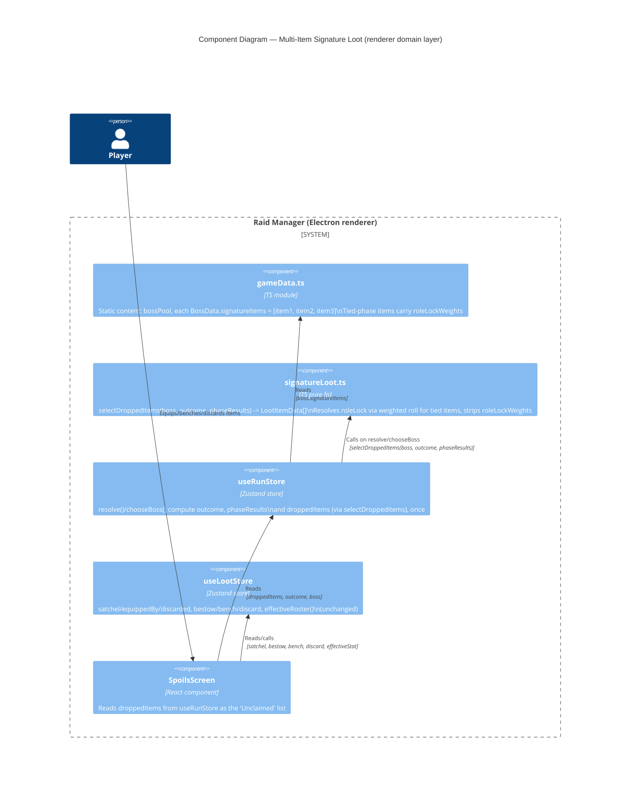

# Architecture: Multi-Item Signature Loot (Per-Phase Items)

> **File**: `docs/feature/loot_signature_items_v2/architecture.md`
> **Ticket / Need**: `loot_signature_items_v2` (no ticket system; user request)
> **Status**: `approved`

---

<!--
ai_context:
  need: "Each boss currently grants a single signature item on any non-Defeat outcome. The redesign (docs/feature/loot_signature_items_v2/game_design.md) splits this into 3 items per boss, one derived per phase, with drop count gated by outcome (Full Victory = all 3, Narrow Victory = only the 2 items tied to succeeded phases, Defeat = 0)."
  domain: "Raid Manager — Loot (Customer/Supplier of Run/Boss Encounter)"
  constraints:
    - "Client-only React/TS/Zustand app (app/src/renderer/src), no backend involved"
    - "useLootStore's bestow/bench/discard/satchel/effectiveRoster pipeline must not change shape — new items flow through it unchanged"
    - "attemptBoss()/effectiveRoster() seam (tech_debt.md, 'Single seam for member-stat reads') is untouched by this design"
    - "All per-boss tie-break weightings already authored in game_design.md must be reproducible by the runtime roll"
  quality_priorities: ["simplicity", "minimal blast radius on existing satchel/bestow pipeline", "no UI flicker from the new randomness"]
  decisions:
    - "ADR-001: tied-phase Role Lock is resolved via a runtime weighted roll, computed once at boss-resolution time and stored in run state — not authoring-time-fixed, not recomputed on render."
  open_questions:
    - "OQ-1: The Sundered Titan's P2 (1/3/3 Tank-Heal tie) and P3 (3/3/2 DPS-Tank tie) authored weightings are not yet specified in game_design.md — needed before gameData.ts content authoring for that boss."
    - "OQ-2: Full 3-item signatureItems arrays for the 6 remaining bosses (Zaelith, Karthus, Grizzelmaw, Hollow Author, Countess Mireth, Sundered Titan) still need authoring — mechanical derivation, not an architectural concern, but blocks gameData.ts completion."
  assumptions:
    - "A-1: BossData.phases array order maps 1:1 to LootItemData.sourcePhase (index 0 -> sourcePhase 1, etc.)"
    - "A-2: Math.random() (already used for phase-success rolls in attemptBoss) is sufficient RNG for the roleLock weighted roll — no seeding/determinism/replay requirement"
-->

---

## 1. Need

Today, `BossData.signatureItem` is a single `LootItemData` granted whenever a boss attempt's outcome is not `DEFEAT` (`SpoilsScreen` reads `boss.signatureItem` directly). The redesign in `game_design.md` replaces this with **3 items per boss, one derived per phase**, and ties the drop *count* to the outcome:

- Full Victory (3/3 phases succeeded) → all 3 items.
- Narrow Victory (2/3) → only the 2 items whose source phase succeeded.
- Defeat → 0 items (unchanged).

Each item's Role Lock is derived from its source phase's highest-weight role (`dpsWeight`/`tankWeight`/`healWeight`). When a phase's weights are tied, the design authors a per-boss weighted distribution to break the tie — explicitly called out in `game_design.md` as "the only randomness in the loot system."

This architecture defines the data contract and computation seam needed to implement that redesign without disturbing the existing satchel/bestow/discard pipeline in `useLootStore`.

---

## 2. Goals & Non-Goals

### Goals

- [ ] `LootItemData` gains `sourcePhase: 1 | 2 | 3` (required) and an optional `roleLockWeights?: Partial<Record<Role, number>>` for tied-phase items.
- [ ] `BossData.signatureItem: LootItemData` becomes `BossData.signatureItems: [LootItemData, LootItemData, LootItemData]` — one per phase, in phase order.
- [ ] A new pure function `selectDroppedItems(boss, outcome, phaseResults): LootItemData[]` implements the drop-count-by-outcome rule (Full=3, Narrow=succeeded-phase items only, Defeat=[]).
- [ ] For items with `roleLockWeights`, `selectDroppedItems` resolves a concrete `roleLock` via a weighted random roll, returning a clone with `roleLockWeights` stripped — downstream consumers never see the weight table.
- [ ] `useRunStore` computes `droppedItems` exactly once, alongside `outcome`/`phaseResults`, in `resolve()` and `chooseBoss()`, and exposes it as run state.
- [ ] `SpoilsScreen` sources its "Unclaimed" drop list from `useRunStore`'s `droppedItems` instead of `boss.signatureItem`.

### Non-Goals

- Authoring the actual 3-item `signatureItems` arrays (and the Sundered Titan's tie weightings) for all 10 bosses — content work, mechanically derived per `game_design.md`, tracked as OQ-1/OQ-2.
- Any change to `useLootStore`'s `bestow`/`bench`/`discard`/`effectiveStat`/`effectiveRoster` — items continue to flow through this pipeline unchanged regardless of count.
- Any change to `attemptBoss()` phase-success math or the `effectiveRoster()` seam (tech_debt.md).
- Visual/UI redesign of `SpoilsScreen`/`LootCard` beyond sourcing the new drop list (e.g. "3 items dropped" framing) — left to `frontend-development`.
- Cross-run persistence, seeding, or replay of roleLock rolls.

---

## 3. Domain Map

Single existing bounded context — no new context introduced.

| Context | Classification | Owns | Does NOT own |
|---|---|---|---|
| Loot | Supporting | `LootItemData`/`BossData.signatureItems` shapes, `selectDroppedItems` drop-selection + tie-break roll, satchel/bestow/bench/discard pipeline (`useLootStore`) | Phase success math, run/boss progression (`useRunStore`) |
| Run / Boss Encounter | Core | `runBosses`, `bossIndex`, `phaseResults`, `outcome`, and now `droppedItems` (computed via Loot's `selectDroppedItems`) | Satchel/equip/discard state, item bonus application |

### Context Relationships

- `Run/BossEncounter → selectDroppedItems (Loot logic)`: Customer/Supplier — Run calls Loot's pure drop-selection function with `(boss, outcome, phaseResults)` and stores the result as `droppedItems`.
- `SpoilsScreen → useRunStore`: Conformist — reads `droppedItems` directly; no independent drop-selection logic in the screen.
- `SpoilsScreen → useLootStore`: unchanged — `bestow`/`bench`/`discard` still operate per-item, item count is incidental to that pipeline.

---

## 4. Architectural Decisions Summary

| # | Decision | Chosen Option | Rationale (one line) | ADR |
|---|---|---|---|---|
| 1 | Timing of tied-phase Role Lock resolution | Runtime weighted roll, computed once at resolve-time, stored in run state | Matches "only randomness in the loot system" intent; avoids render-time re-roll/flicker | [ADR-001](../../adr/ADR-001-tied-phase-rolelock-runtime-roll.md) |

No other decision in this redesign rises to ADR level — the `signatureItem` → `signatureItems` array change and the `sourcePhase` field are direct, low-risk extensions of the existing `LootItemData`/`BossData` shapes, additive within the existing Loot context, same as the boss-pool-draft and boss-choice precedents.

---

## 5. Thinking Process

### What we started with

A single `signatureItem: LootItemData` per boss, granted as-is on any non-Defeat outcome, read directly by `SpoilsScreen` from `boss.signatureItem`. `game_design.md` had already locked the gameplay rules (3 items, per-phase derivation, drop-count-by-outcome, per-boss authored tie-break weightings) — this session's job was the data contract and computation seam.

### What we explored

**Topic: When does the tied-phase Role Lock weighting actually resolve?**

Two readings of `game_design.md`'s "authored random weighting... the only randomness in the loot system" were both plausible:

1. **Authoring-time roll** — the weighted roll already happened during design; the "→ Tank" results shown in the doc are final, and `gameData.ts` simply hardcodes `roleLock: Role.TANK` like any other item. No runtime randomness, no contract change beyond `sourcePhase`.
2. **Runtime roll** — `gameData.ts` stores the *weight table* for tied items; the actual `roleLock` is rolled each time the item drops, producing run-to-run variance.

The user chose **runtime roll**. This is the one decision in this redesign with a real, non-obvious alternative and a contract-level consequence (an extra optional field, plus a defined resolution point), so it was promoted to ADR-001.

**Topic: Where/when is the runtime roll computed, to avoid flicker?**

A roll computed inside `SpoilsScreen` (e.g. in a `useMemo`) risks re-rolling on remounts/re-renders, causing the same boss-clear to show a different `roleLock` for a tied item across renders — confusing and a balance-relevant detail (which role can equip it). Resolved by computing `droppedItems` exactly once, inside `useRunStore.resolve()`/`chooseBoss()`, alongside the existing `outcome`/`phaseResults` computation, and storing it as run state. `SpoilsScreen` becomes a pure consumer.

### What changed during the process

- No revisions to the goals as scoped — `game_design.md`'s rules were already stable going in. The only open fork (authoring-time vs runtime roll) was resolved in favour of runtime, per ADR-001.

### What remains open

- OQ-1 — Sundered Titan's two tied-phase weightings are not yet authored.
- OQ-2 — 6 bosses' full `signatureItems` arrays still need content authoring.

Both are content/data tasks for `gameData.ts`, mechanically derivable per `game_design.md`'s rules, and do not block the contract/mechanism work in this architecture.

---

## 6. System Diagram

---

## 7. Open Questions

| ID | Question | Impact if unresolved | Owner | Due |
|---|---|---|---|---|
| OQ-1 | What are the authored tie-break weightings for The Sundered Titan's P2 (1/3/3 Tank-Heal) and P3 (3/3/2 DPS-Tank)? | `gameData.ts` cannot fully author this boss's `signatureItems`; `roleLockWeights` would be missing for 2 of its 3 items | User (game design) | Before `gameData.ts` content work for this boss |
| OQ-2 | Full `signatureItems` (3 items) for the 6 remaining bosses | `bossPool` left in mixed old/new shape until authored | User (game design) / `frontend-development` | Before this feature can ship for those bosses |

---

## 8. Assumptions

| ID | Assumption | Consequence if wrong | Validated? |
|---|---|---|---|
| A-1 | `BossData.phases[i]` maps to `signatureItems[i]` (`sourcePhase = i + 1`) | `selectDroppedItems` would match the wrong item to the wrong `phaseResults` entry on Narrow Victory | ☑ (matches `game_design.md`'s "one derived per phase" framing) |
| A-2 | `Math.random()` is sufficient RNG for the `roleLockWeights` roll, no seeding/determinism needed | If replay/seeding is later required, this roll becomes a second RNG call site to retrofit alongside `attemptBoss`'s phase-success rolls | ☑ (consistent with existing `attemptBoss` use of `Math.random()`) |

---

## 9. Follow-up Actions

- [ ] Implement via `frontend-development`: extend `lootData.ts` (`sourcePhase`, `roleLockWeights`, `createLootItem` signature), `bossData.ts` (`signatureItems: [LootItemData, LootItemData, LootItemData]`), add `domain/logic/signatureLoot.ts` (`selectDroppedItems`), extend `useRunStore` (`droppedItems`), update `SpoilsScreen` to consume it.
- [ ] Resolve OQ-1 with the user (game design) before authoring The Sundered Titan's items.
- [ ] Author remaining `signatureItems` (OQ-2) per `game_design.md`'s derivation rules.
