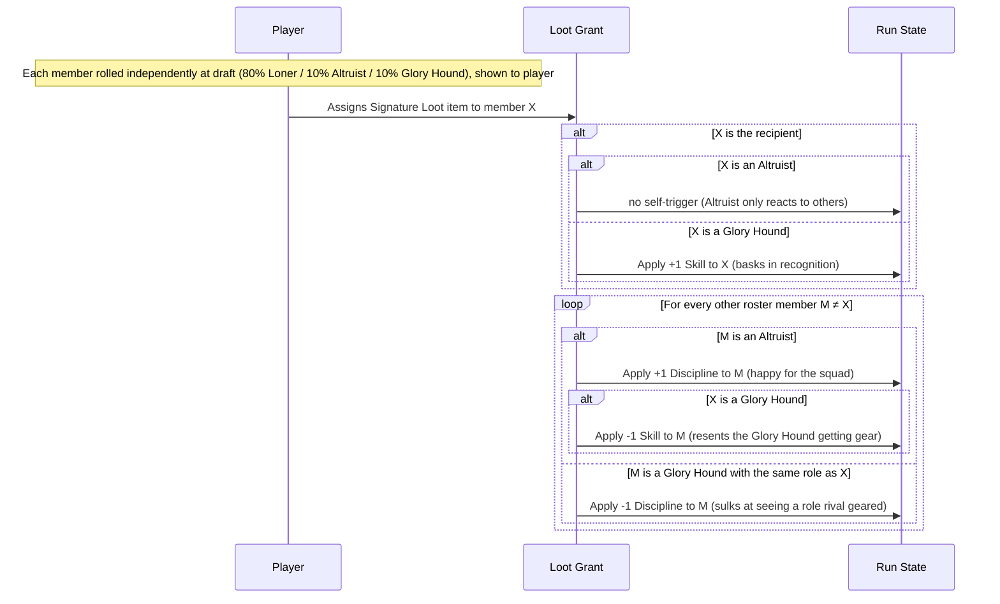

# Game Design — Member Personalities

## Summary

Each roster member carries a **personality** — `Loner`, `Altruist`, or `Glory Hound` — rolled independently at draft time with weights **80% / 10% / 10%**. The trait is **visible to the player at draft** (FM-style scouting: you knowingly draft a Glory Hound for their Skill, aware of the friction risk). Personalities react to **Signature Loot grants** during the run, applying small permanent Skill/Discipline deltas that color how that member performs for the rest of the run.

This adds a layer of roster-management tension on top of the existing loot-distribution decision — "do I gear up my star Glory Hound (and risk souring my Altruists), or spread loot to the group (and risk the Glory Hound sulking)?" — without introducing any new screens or systems beyond what Signature Loot already provides.

## Why We Are Building This

Right now every roster member is a pure stat block: Skill, Discipline, Role, Name, with loot only ever improving stats. Personalities make the **loot-grant moment** — already a meaningful player decision — carry social weight: who you gear up changes how *other* members feel and perform. A Loner (80% of the roster) is unaffected — the baseline. A Glory Hound basks when gifted loot and sulks when a member of their own role is geared instead. An Altruist is heartened when others get gear, but resents seeing a Glory Hound rewarded. This turns loot decisions into roster-management trade-offs, not just stat optimization.

## Goals

- Make Signature Loot grants matter beyond the immediate stat bump — they ripple through how members feel about each other
- Keep personalities visible at draft time so picking a Glory Hound (or an Altruist-heavy roster) is an informed risk, not a hidden trap
- Keep the mechanical surface small: flat, permanent, stacking Skill/Discipline deltas reusing the existing loot-bonus plumbing
- Keep the roll simple and procedural — pure independent random roll per member, no forced distribution

## Non-Goals

- No new screens, prompts, or player-facing choices beyond the existing loot-grant decision
- No redemption arcs or personality changes — a member's personality is fixed for the run
- No personality types beyond Loner / Altruist / Glory Hound in this iteration
- No guaranteed presence — a roster with zero Altruists and/or zero Glory Hounds is an accepted, expected outcome (replayability variance)
- No effect outside of loot-grant events — personalities don't react to draft picks, phase outcomes, or anything else

---

## Data Model

### Personality

| Property | Type | Description |
|---|---|---|
| Type | enum | `Loner` / `Altruist` / `Glory Hound` |
| Trigger | event | A Signature Loot grant during the run |
| Skill Delta | int | Flat permanent adjustment to Skill, applied when the trigger condition is met |
| Discipline Delta | int | Flat permanent adjustment to Discipline, applied when the trigger condition is met |

### Personality Catalogue

| Personality | Trigger condition | Skill Delta | Discipline Delta | Flavor |
|---|---|---|---|---|
| **Loner** | n/a | — | — | No reaction to anything. Pure baseline. |
| **Altruist** | Loot is granted to **another member** (not self) | — | **+1** | Happy to see the squad gear up — becomes more reliable |
| **Altruist** | Loot is granted to a **Glory Hound** | **−1** | — | Resents members who don't play for the guild — personal performance dips |
| **Glory Hound** | Loot is granted to **self** | **+1** | — | Basks in the recognition — performs better |
| **Glory Hound** | Loot is granted to **someone else of the same role** | — | **−1** | Sulks at seeing a role rival geared instead — becomes less reliable ("loses reliability" → Discipline decreases) |

### Roll

- At the moment a member is added to the roster (drafted), roll their personality **independently**:
  - **80% chance** — Loner
  - **10% chance** — Altruist
  - **10% chance** — Glory Hound
- Pure random roll, performed once per member, with no forced balancing — a run may end up with zero Altruists and/or zero Glory Hounds, and that's accepted as natural replayability variance, not a bug to fix

---

## Visibility

- **At draft**: the member's personality is shown alongside their existing properties (Name, Role, Skill, Discipline) — the player can see they're drafting a Glory Hound or an Altruist and weigh the risk/reward knowingly
- **Fixed for the run**: personality never changes once rolled — no hidden reveals, no redemption arcs, no escalation
- **After triggers fire**: the member's adjusted Skill/Discipline is reflected wherever effective stats are shown (mirroring how equipped loot bonuses are surfaced today)

---

## Trigger Moments

All triggers fire on **Signature Loot grant events** — the moment the player assigns an item to a roster member.

### Altruist

- **Loot to another member**: every time loot is granted to anyone other than this Altruist, their Discipline **+1** (stacks across multiple grants, clamped to [0, 5])
- **Loot to a Glory Hound**: every time loot is granted to *any* Glory Hound on the roster, this Altruist's Skill **−1** (stacks, clamped to [0, 5]) — the two effects can both fire from the same grant event if the recipient is a Glory Hound (the Altruist is happy gear went to a teammate, but resentful it went to *that* teammate)

### Glory Hound

- **Loot to self**: every time this Glory Hound personally receives loot, their Skill **+1** (stacks, clamped to [0, 5])
- **Loot to a same-role member**: every time loot is granted to another member who shares this Glory Hound's role, their Discipline **−1** (stacks, clamped to [0, 5]). Grants to members of other roles leave the Glory Hound indifferent — they only resent being out-shone in their own role

### Loner

- No triggers, no deltas. Unaffected by any loot-grant event.

---

## Mechanical Integration

Personalities reuse the **existing stat-bonus plumbing** introduced for Signature Loot — no parallel system required:

- Each fired trigger applies a flat Skill and/or Discipline delta to the affected member, accumulated the same way loot bonuses are: added to a per-member running total and combined with the base stat through the existing `effectiveStat` calculation
- The existing `clampStat()` helper ([0, 100]) applies identically — deltas that would push a stat past the bounds are simply clamped, exactly as loot bonuses are today
- These deltas are **persistent and stacking**: every qualifying loot-grant event during the run re-fires the relevant trigger(s) and adds another delta to the accumulator (not a one-time effect)
- Because loot bonuses and personality deltas feed the same accumulator and the same clamp, they compose for free with no special-casing

---

## Flow

---

## Worked Example

Roster includes **Marrow Vex** (Glory Hound, DPS), **Sera Lindwell** (Altruist, Heal), and several Loners.

1. Player grants an item to **Marrow Vex**. Marrow Vex's Skill rises from 3 to **4** (basks in the recognition). Sera Lindwell's Discipline rises from 2 to **3** (happy gear went to a teammate) but her Skill drops from 3 to **2** (resents that it went to a Glory Hound specifically). Loners are unaffected.
2. Later, the player grants an item to a Loner **DPS** instead. Marrow Vex's Discipline drops from 3 to **2** (sulks at seeing a fellow DPS geared over him). Sera Lindwell's Discipline rises again, from 3 to **4** (happy for the squad — no Glory Hound penalty this time, since the recipient wasn't one).
3. Later still, the player grants an item to a Loner **Tank**. Marrow Vex doesn't react — the recipient is no rival to a DPS. Sera Lindwell's Discipline rises again (capped at 5).
4. All deltas persist and stack for the rest of the run, composing normally with the item's own stat bonuses through the existing `effectiveStat` + `clampStat` pipeline.

---

## Notes

This spec finalizes the open points raised during design review:

- **Sign convention**: Glory Hound's "loses reliability" when a same-role rival is geared maps to **Discipline −1** (a decrease) — high Discipline is good in this system, so "losing reliability" must lower it
- **Caps**: handled entirely by the existing `clampStat()` ([0, 5]) and per-member bonus accumulator — no new clamping logic needed
- **Roll model**: pure independent random roll per member at draft (80% Loner / 10% Altruist / 10% Glory Hound), visible to the player at draft time. No forced "at least one of each" — occasional runs with zero Altruists and/or zero Glory Hounds are accepted as natural replayability variance
- **Fixed personality**: no redemption arcs — a member's personality never changes once rolled
