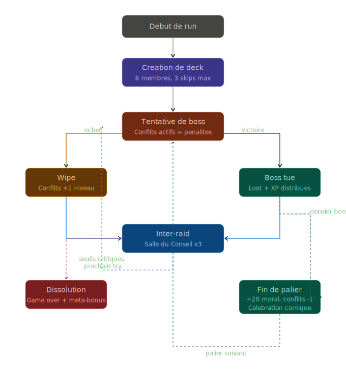

# Système 02 — Mécaniques de rattrapage (Rubber Band)

## Contexte

### Idée de base
Dans tout roguelike avec des systèmes interconnectés, une suite de défaites peut créer un "death spiral" — une spirale descendante dont il est impossible de sortir. Le joueur perd non pas parce qu'il joue mal, mais parce que le système s'emballe contre lui.

Il fallait donc intégrer des mécaniques qui s'activent **précisément quand le joueur est en difficulté**, sans pour autant le sauver automatiquement.

### Itérations
La première approche envisagée était des bonus mécaniques purs (ressources bonus, tentatives supplémentaires). Fonctionnel mais sans âme.

La version retenue tire parti du **ton humoristique du jeu** : les mécaniques de rattrapage sont des événements absurdes et comiques qui émergent naturellement du chaos de la guilde en déroute. La difficulté devient du contenu narratif.

---

## Définition

Une mécanique de rattrapage est un événement proposant un bonus à la guilde. Elle doit être prévisible (déclencheur), apporter un bonus au prix d'autre chose (un effect mécanique et une contrepartie)

---

## Exemples de mécaniques de rattrapage

### 1 — Le Héros du Désespoir
Quand la guilde est en difficulté, un membre aléatoire "pète un câble dans le bon sens" et devient temporairement surpuissant.

> *"Kévin3000, le mage AFK depuis 3 raids, se réveille soudainement et one-shot le boss par accident."*

- **Déclencheur** : X wipes consécutifs sur le même boss
- **Effet mécanique** : bonus massif sur une tentative
- **Contrepartie** : le membre retombe à son niveau normal après

### 2 — Le Rage Quit inversé
Quand le moral collectif est au plus bas, certains membres deviennent irrationnellement motivés par la honte plutôt que de partir.

> *"Après le 8ème wipe, Pandapower écrit 'ON Y RETOURNE' en majuscules. Le groupe est galvanisé."*

- **Déclencheur** : moral collectif sous un seuil critique
- **Effet mécanique** : regain temporaire de moral pour toute la guilde
- **Contrepartie** : en cas d'échec du try, tous les membres de la guilde gagnent 1 niveau de conflit envers Pandapower.

---

## Pourquoi c'est une bonne idée

- Les mécaniques de rattrapage sont **visibles avant la crise** : le joueur sait qu'elles existent et garde espoir
- Leur forme est **aléatoire** : la surprise reste entière à chaque run
- Elles sont **insuffisantes seules** : elles donnent une chance, pas une victoire automatique — la victoire reste méritée
- Le ton comique transforme les moments de crise en **pics d'émotion positifs** plutôt qu'en frustration pure
- Elles créent des **histoires mémorables** que le joueur voudra raconter ("ma guilde s'est sauvée grâce à Kévin")

---

## Ce à quoi il faut faire attention

- **Ne pas les rendre trop puissantes** : si le rubber band sauve systématiquement le joueur, il n'y a plus de tension. Ce sont des bouées, pas des hélicoptères de secours.
- **Ne pas les déclencher trop tôt** : si elles apparaissent au premier wipe, elles perdent leur caractère exceptionnel. Les seuils de déclenchement doivent être calibrés finement.
- **Cohérence narrative** : le ton absurde doit rester cohérent. Un événement trop sérieux au milieu des mécaniques comiques casserait l'ambiance.
- **Lisibilité** : le joueur doit comprendre pourquoi l'événement s'est déclenché. Un rubber band qui arrive "de nulle part" sera perçu comme du hasard pur, pas comme un système.

---

## Schémas et prototypes

Les mécaniques de rattrapage sont intégrées dans la boucle de jeu principale :
- Le chemin "Wipe → Événement comique → Salle du Conseil" représente leur point d'insertion dans le flux
- Elles ne court-circuitent pas la boucle — elles s'y greffent comme une branche conditionnelle

---

## Évolutions possibles

- **Rubber band mémorisé** : si Kévin a déjà sauvé la guilde une fois, il devient un personnage récurrent avec une "légende" qui grandit à chaque run
- **Choix du rubber band** : présenter deux options de rattrapage au joueur (ex : "Le Héros du Désespoir" ou "Le Recrutement Désespéré") pour garder de l'agentivité
- **Rubber band négatif** : une mécanique symétrique qui complique les runs trop faciles — le jeu détecte que le joueur est en avance et crée des événements déstabilisants
- **Débloquer des rubber bands via la méta-progression** : certains types d'événements de rattrapage se débloquent avec les Legs de Guilde entre les runs
