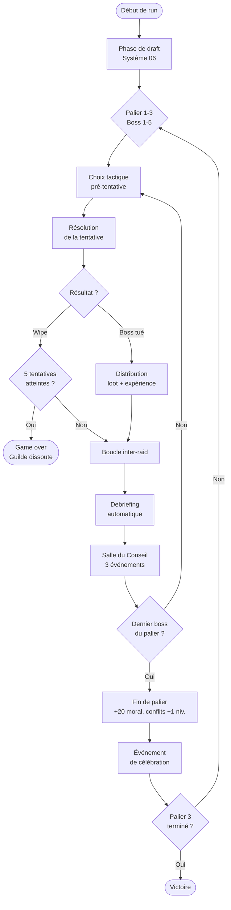
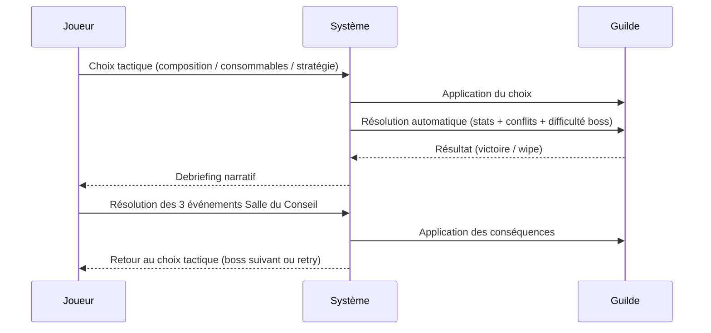

# Système 09 — La boucle de jeu principale

## Contexte

### Idée de base
Les systèmes 01 à 08 définissent chacun un mécanisme isolé. Ce document les assemble en une boucle de jeu cohérente et complète — de la création du deck au game over, en passant par les tentatives de boss, les inter-raids, les fins de palier et la victoire finale.

L'objectif est de répondre à une question simple : **dans quel ordre les choses se passent-elles, et pourquoi cet ordre est-il le bon ?**

### Itérations
Version initiale : une boucle plate — draft, puis succession de boss, puis game over. Simple mais sans rythme. Le joueur n'a pas de points de respiration ni de montée en tension naturelle.

Version intermédiaire : introduction de l'inter-raid entre chaque boss et d'une fin de run après le dernier boss. Meilleur rythme, mais les paliers ne sont pas différenciés — la progression manque de sens.

Version retenue : **une structure en 3 paliers de 5 boss chacun**, avec une boucle inter-raid après chaque tentative et une respiration de fin de palier entre les trois niveaux de difficulté. La victoire se mérite sur 15 boss, avec une pression croissante qui s'allège volontairement à chaque franchissement de palier.

---

## La structure d'une run

Une run complète se compose de :
- **3 paliers** (Normal → Héroïque → Mythique)
- **5 boss par palier**, soit **15 boss au total**
- **5 tentatives maximum par boss** — au-delà, les membres gquit et la guilde se dissout (game over, Système 01)
- **1 choix tactique avant chaque tentative** — composition, consommables, stratégie
- **1 boucle inter-raid après chaque tentative** — Debriefing + Salle du Conseil (3 événements)
- **1 séquence de fin de palier après chaque dernier boss de palier** — reset partiel + événement de célébration

La **condition de victoire** est la mort du 5ème boss du Palier 3 (Mythique).

---

## Phase 0 — Création du deck

Avant le premier boss, le joueur compose sa guilde de **8 membres** via un système de draft (Système 06).

La phase se déroule en 8 tirages successifs : 3 profils proposés par tirage, le joueur en choisit un ou passe. Il dispose de 3 skips maximum sur toute la phase.

Ce qui est visible au draft : nom, classe, rôle (Tank / Healer / DPS), Skill, Moral, traits de personnalité.

Ce qui est caché au draft : synergies de conflit potentielles entre membres, relations pré-existantes, capacités passives débloquées à l'expérience.

La composition finale est fixe pour toute la run. Une fois le draft terminé, la run commence immédiatement avec le Palier 1, Boss 1.

---

## Phase 1 — La tentative de boss

### Le choix tactique (avant la tentative)
Avant chaque tentative, le joueur effectue **un seul choix tactique**. Ce choix est irréversible pour la tentative en cours.

Trois catégories de choix sont disponibles :

| Catégorie | Exemple |
|---|---|
| Composition | Changer l'assignation d'un membre (tank défensif vs offensif, healer de spot vs healer de raid) |
| Consommables | Utiliser des potions, des parchemins de buff, des repas de guilde |
| Stratégie | Choisir une approche prioritaire (burst DPS rapide, survie longue durée, ignore d'une mécanique) |

Ce choix est le seul moment d'agentivité directe du joueur sur la tentative elle-même. Tout ce qui suit est résolu par le système en fonction des stats de la guilde.

### La résolution de la tentative
La tentative est résolue automatiquement à partir de :
- Les stats des membres impliqués (Skill, Fiabilité, Moral, Expérience — Système 05)
- Les conflits actifs et leurs pénalités (Système 07)
- Le choix tactique du joueur
- La difficulté du boss (palier × position dans le palier)

**Deux sorties possibles :**
- **Boss tué** → distribution de loot + expérience, puis boucle inter-raid
- **Wipe** → compteur de tentatives +1, puis boucle inter-raid

Si le compteur atteint 5 wipes sans victoire, les membres perdent foi dans la guilde et décident de gquit collectivement. La guilde se dissout — c'est le game over (Système 01).

---

## Phase 2 — La boucle inter-raid

La boucle inter-raid se déclenche après chaque tentative, victoire ou wipe. Elle se compose de deux phases séquentielles (Système 03).

### Phase 2a — Le Debriefing
Le jeu génère automatiquement un compte-rendu absurde mais informatif de la tentative.

> *"Analyse du wipe : Sardoche3000 a marché dans la même zone rouge 4 fois. Il assure que c'était intentionnel."*

Le Debriefing révèle :
- Quel membre a sous-performé (et pourquoi)
- Quelle ressource manquait
- Quel rôle était défaillant
- Les éventuels effets de conflit actifs qui ont pesé sur le résultat

Le ton est comique mais les informations sont stratégiquement utiles. C'est le seul retour que le joueur reçoit sur la tentative.

### Phase 2b — La Salle du Conseil
Le joueur reçoit **3 événements** à résoudre, dans l'ordre de son choix, piochés dans un pool contextuellement pondéré (Systèmes 04 et 08).

**Règle de pondération :**
- Si un conflit niveau 3+ est actif → un événement de conflit est garanti
- Si le moral collectif est bas → priorité aux événements Membre
- Si la banque est vide → priorité aux événements Ressources
- Sinon → pioche aléatoire pondérée entre les 4 catégories (Membre, Ressources, Conflit, Externe)

Chaque événement propose 2 à 3 choix avec effets visibles et effets cachés. Certains événements proposent des choix enchaînés (maximum 2 niveaux de profondeur). L'ordre de résolution peut modifier les options disponibles sur les événements suivants.

**Ce que la Salle du Conseil ne couvre pas ce tour-ci empire seul** — les conflits non traités montent d'un niveau à chaque inter-raid sans événement dédié (Système 07).

Une fois les 3 événements résolus, la boucle inter-raid se termine. Le joueur est renvoyé au choix tactique du boss suivant.

---

## Phase 3 — Fin de palier

La fin de palier se déclenche après la mort du **5ème boss d'un palier**, qu'il soit tué ou abandonné.

### Réinitialisation automatique
Avant tout événement, le jeu applique les effets suivants à toute la guilde :
- **Moral** : +20 flat pour tous les membres, sans exception
- **Conflits** : tous les conflits actifs descendent d'un niveau (niveau 1 → résolu, niveau 4 → niveau 3)

Ces effets sont appliqués et communiqués clairement au joueur avant la Salle du Conseil de fin de palier.

**Le dilemme des synergies de conflit** : pour les joueurs qui exploitent un conflit actif comme synergie (Système 07), la descente automatique d'un niveau peut désactiver cet avantage. C'est un coût caché de la stratégie de conflit, pas un bug.

### L'événement de célébration
Un unique événement de célébration remplace les 3 événements habituels de la Salle du Conseil.

> *"La guilde fête la victoire en Normale. Kévin a commandé une pizza pour tout le monde. Il a oublié que Flamius est végétalien. Flamius mange la pizza quand même. Quelque chose a changé entre eux."*

Pas de choix difficile — juste un moment narratif comique qui marque la transition vers la difficulté suivante et récompense le joueur émotionnellement.

### Transition vers le palier suivant
Après l'événement de célébration, la run reprend avec le Palier suivant, Boss 1. Le choix tactique est disponible immédiatement.

---

## Phase 4 — Fin de run

### Victoire
La victoire se déclenche après la mort du **5ème boss du Palier 3 (Mythique)**. La run est terminée. Le jeu déclenche une séquence de conclusion narrative et enregistre les résultats pour la méta-progression.

### Dissolution (game over)
Après 5 wipes sans victoire sur un boss, les membres gquit et la guilde se dissout (Système 01). La run s'arrête immédiatement.

La dissolution est présentée comme une conclusion narrative : les membres perdent foi, quittent le jeu un par un, et la guilde disparaît. Ce n'est pas un écran de game over abstrait — c'est la fin logique d'une aventure collective qui a atteint ses limites.

---

## Pourquoi cet assemblage fonctionne

**Le choix tactique pré-tentative concentre l'agentivité** au bon endroit : le joueur réfléchit avant d'agir, pas pendant. Il n'y a pas de micro-gestion pendant le combat — uniquement la tension de l'attente et du résultat.

**La boucle inter-raid crée le rythme** : chaque tentative est suivie d'un moment narratif et stratégique. Le joueur ne subit jamais passivement une série d'échecs — il réagit, décide, et reprend la main entre chaque try.

**Les 5 tentatives par boss calibrent la pression** : assez pour qu'un boss difficile se gère, pas assez pour qu'il soit trivial. Le compteur est une ressource — et quand il tombe à zéro, c'est fini.

**Les 3 paliers structurent l'arc émotionnel du run** : le joueur monte en tension sur 5 boss, respire à la fin du palier, repart plus fort mais sur un terrain plus difficile. Trois fois. La structure est prévisible mais la tension reste réelle.

**La fin de palier est une respiration méritée**, pas un cadeau gratuit. Le +20 moral et la descente des conflits d'un niveau réparent sans effacer — les conséquences des mauvaises décisions persistent au-delà de la respiration.

---

## Ce à quoi il faut faire attention

**Le mur infranchissable** est désormais le risque central (Système 01). Un boss mal calibré peut consommer les 5 tentatives sans que le joueur ait les outils pour s'en sortir. Les mécaniques de rattrapage (Système 02) sont le garde-fou — s'assurer qu'elles se déclenchent avant la 5ème tentative, pas après.

**Le choix tactique ne doit jamais avoir de réponse dominante**. Si une composition ou une stratégie est systématiquement optimale quel que soit le contexte, la phase de choix perd son intérêt. Calibrer les boss pour que différentes approches soient viables selon la composition de la guilde.

**La durée d'un inter-raid doit rester courte** (5 à 10 minutes). Si la Salle du Conseil devient trop lourde, elle brise le rythme au lieu de l'enrichir. Les événements à choix enchaînés ne doivent pas dépasser 2 niveaux de profondeur.

**Communiquer clairement les transitions** : le joueur doit toujours savoir dans quelle phase il se trouve (tentative en cours, inter-raid, fin de palier) et ce qui l'attend ensuite. L'interface doit indiquer explicitement : numéro du boss, numéro de la tentative, palier actuel.

**Le +20 moral de fin de palier ne doit pas être anticipé comme une assurance**. Si le joueur joue négligemment les 5ème boss en sachant qu'un reset arrive, la tension de fin de palier disparaît. Envisager une communication tardive du bonus (annoncé après la mort du boss, pas avant).

**Les 15 boss doivent avoir une difficulté lisiblement croissante** sans que le saut entre paliers soit brutal. Le Palier 2 doit être ressenti comme plus dur que le Palier 1, mais pas impossible — le reset partiel de fin de palier est conçu pour que la guilde arrive en état de combattre.

---

## Schémas et prototypes

### Vue macro de la boucle de run complète

### Détail d'une tentative : les cinq slots de décision

---

## Liens vers les systèmes référencés

| Système | Sujet | Lien |
|---|---|---|
| 01 | Conditions de défaite | `01_conditions_de_defaite.md` |
| 02 | Mécaniques de rattrapage | `02_mecaniques_de_rattrapage.md` |
| 03 | Boucle inter-raid | `03_boucle_inter_raid.md` |
| 04 | Salle du Conseil | `04_salle_du_conseil.md` |
| 05 | Système de membres | `05_systeme_de_membres.md` |
| 06 | Création de deck | `06_creation_de_deck.md` |
| 07 | Conflits inter-membres | `07_conflits_inter_membres.md` |
| 08 | Salle du Conseil v2 et fin de palier | `08_salle_du_conseil_v2_et_fin_de_palier.md` |

---

## Évolutions possibles

- **Niveaux de difficulté** : ajuster le nombre de tentatives par boss (3 en mode Hardcore, 7 en mode Découverte) et les seuils de dissolution sans modifier la structure de la boucle
- **Boss optionnels** : introduire un 6ème boss optionnel par palier — plus difficile, récompense supérieure, tentatives réduites à 3. Le joueur choisit de l'affronter ou de passer directement à la fin de palier
- **Variante de run courte** : un seul palier de 5 boss pour les sessions ultra-courtes, sans fin de palier — pour les contextes mobiles où une heure n'est pas disponible
- **Événements de boss narratifs** : certains boss déclenchent des événements spécifiques en Salle du Conseil (ex : un boss connu pour humilier les tanks déclenche un événement de moral négatif pour le tank après un wipe)
- **Mémoire cross-run** : via les Legs de Guilde, certaines informations d'un run précédent influencent le draft ou les événements du run suivant — les histoires s'accumulent entre les runs
- **Mode Chrono** : la run est contrainte par un nombre maximum d'inter-raids, pas par un timer réel. Chaque inter-raid consomme un "tour de calendrier". Dépasser le quota = dissolution par abandon du serveur
