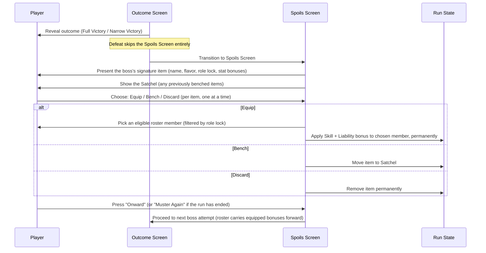

# Game Design — Signature Loot

## Summary

After each boss attempt that ends in **Full Victory** or **Narrow Victory**, the boss drops one **signature item** — a piece of loot thematically tied to that boss's identity and phases. The player may **equip it on a roster member, bench it for later, or discard it**. Equipped items grant small, permanent, strictly-positive boosts to both **Skill and Liability**, stacking gradually across the gauntlet's up to 15 bosses. Loot is **role-locked**: each item can only be equipped by members of a specific role (Tank, Heal, or DPS), reflecting its thematic origin (a boss's tank-phase relic becomes a Tank-only item, and so on).

This system turns "what do we do with the spoils" into a recurring, low-friction decision point that compounds roster strength over a run without ever introducing a downside or a forced choice.

---

## Why We Are Building This

Right now, defeating a boss in the gauntlet only opens the door to the next fight — there is no lasting reward, no sense of the roster growing stronger, and no reason to care about *how* a boss was beaten beyond "did we survive." Signature loot gives victories a tangible, persistent payoff: each win leaves a mark on the roster, nudging members' Skill and Liability upward in small steps that echo the boss's identity. Because loot is tied to the boss's phases and theme (Direction C), the rewards also reinforce the gauntlet's narrative — beating "The Rot Unending" should *feel* different from beating "The Endless Dusk," and the loot each leaves behind should say so.

---

## Goals

- Give every Full Victory and Narrow Victory a persistent, positive payoff for the roster
- Tie each boss's loot thematically to its phases and identity (signature loot, Direction C)
- Keep stat growth small and steady so it "drips" across up to 15 bosses without trivializing late-game phase targets
- Let the player freely accept, bench, or discard loot — never force an assignment
- Use role-locking to make loot decisions meaningful relative to the fixed 8-member roster (2 Tank / 2 Heal / 4 DPS)

## Non-Goals

- No double-edged items — there is no "Skill up / Liability down" tradeoff; every item improves both stats
- No relationship, morale, or inter-member hooks of any kind
- No item rarity tiers, sets, upgrades, or crafting systems (out of scope for this iteration)
- No loot from Defeat outcomes — a defeated attempt yields nothing, not even a consolation prize
- No re-drafting or roster changes triggered by loot — the 8 members chosen at the draft remain fixed for the run

---

## Data Model

### Item

| Property      | Type   | Description                                                            |
|---------------|--------|------------------------------------------------------------------------|
| Name          | string | Display name, thematically tied to the dropping boss                  |
| Flavor        | string | One-line description linking the item to the boss's identity/phase    |
| Source Boss   | string | Name of the boss this item is signature loot for                      |
| Role Lock     | enum   | Tank / Heal / DPS — only members of this role can equip the item      |
| Skill Bonus   | int    | Flat permanent bonus added to the wearer's Skill (always positive)    |
| Liability Bonus | int  | Flat permanent bonus added to the wearer's Liability (always positive)|

### Loot Table (per boss)

Each boss in the gauntlet defines exactly **one signature item**, generated from its identity and phase makeup (see "Signature Loot Mapping" below). There is no randomization within a boss's drop — the item is hardcoded per boss, just like phases are.

### Roster Loot State

| Property        | Type        | Description                                                        |
|-----------------|-------------|--------------------------------------------------------------------|
| Equipped Items  | map(member → item[]) | Items currently worn by each member; stat bonuses are active |
| Bench           | item[]      | Items the player declined to assign immediately, kept for later    |
| Discarded       | item[]      | Items the player chose to discard; gone for the rest of the run    |

---

## Rules & Constraints

- An item can only be equipped by a member whose Role matches the item's Role Lock
- Stat bonuses from equipped items are additive and permanent for the remainder of the run (they do not expire, degrade, or get removed once equipped)
- A member may equip multiple items over the course of a run; bonuses stack
- There is no equip-slot cap — the limiting factor is simply how much loot the gauntlet produces (at most 15 items total, one per boss)
- Benched items remain available for assignment after any subsequent boss's loot moment, for the rest of the run
- Discarded items are gone permanently — they cannot be recovered or re-offered
- Loot only drops on Full Victory or Narrow Victory; Defeat yields nothing
- All stat bonuses respect the 0-100 scale: a bonus that would push a stat above 100 is clamped at 100 (this is expected to be rare given the magnitudes below, but the clamp exists as a safety rule)
- Items are never generated at runtime — each boss's signature item is hardcoded, consistent with the rest of the game's data model

---

## Item Magnitude & Curve

**Goal:** small, frequent deltas that drip steadily across up to 15 bosses, building a noticeable but not trivializing edge by the gauntlet's later, harder phases.

- Each item grants **+3 to Skill and +3 to Liability** to its wearer — a flat, modest, dual-stat boost
- Later-gauntlet bosses (harder fights, higher phase targets) drop slightly stronger signature items, **+4/+4**, reflecting their greater narrative and mechanical weight
- No item ever grants a bonus larger than **+5** to a single stat — this keeps any individual drop from being a swing moment, preserving the "steady drip" feel

| Gauntlet position   | Bosses (approx.) | Signature item bonus |
|---------------------|------------------|----------------------|
| Early gauntlet      | Bosses 1–5       | +3 Skill / +3 Liability |
| Mid gauntlet        | Bosses 6–10      | +4 Skill / +4 Liability |
| Late gauntlet       | Bosses 11–15     | +5 Skill / +5 Liability |

**Why this curve works:**

- A member who equips every item offered to their role across a 15-boss gauntlet gains roughly **+50 to +60** to each stat in the extreme — but in practice, loot is spread thematically across roles and most members will receive only a handful of items (role-locking naturally distributes drops rather than letting the player stack everything onto one favorite)
- A more typical outcome — a member equipping 2-4 items over a run — nets roughly **+8 to +18** per stat, enough to visibly shift their contribution to a role average (recall current pool averages sit around Skill 55 / Liability 45) without single-handedly guaranteeing late-phase success against targets in the 70-78 range
- Because bonuses scale up slightly as the gauntlet progresses (+3 → +4 → +5), the late-game "catch-up" keeps pace with the steeper phase targets bosses 11-15 present, rather than letting early loot trivialize them
- The clamp at 100 acts as a soft ceiling: a member who somehow accumulates enormous bonuses simply stops gaining further benefit, rather than breaking the phase-success math

---

## Role Locking

Loot is **role-locked**, not freely assignable across the whole roster. Each item names exactly one of the three existing roles:

| Role  | Who can equip          | Thematic framing examples                                  |
|-------|------------------------|-------------------------------------------------------------|
| Tank  | Either of the 2 Tanks  | Wardstone shields, bulwark plating, anchor-chains           |
| Heal  | Either of the 2 Heals  | Reliquary censers, communion vials, ward-singing chimes     |
| DPS   | Any of the 4 DPS       | Edge-etched blades, venom phials, star-forged arrowheads    |

This mirrors the fixed 8-member roster shape (2 Tank / 2 Heal / 4 DPS) and ensures loot decisions stay grounded in "which of my Tanks (or Heals, or DPS) benefits most" rather than an open free-for-all. Because DPS has twice the slots of the other two roles, DPS-locked loot naturally has more potential recipients — this is intentional and mirrors the roster's own DPS-heavy shape.

---

## Signature Loot Mapping (Direction C)

Each boss's signature item is derived from its **overall identity and phase makeup**, not picked at random. The mapping rule:

1. Look at the boss's three phases. Identify which role carries the **highest combined weight** across all three phases (DPS / Tank / Heal) — that role becomes the item's **Role Lock**, since it's the role most tested by (and most central to) that boss's fight.
2. Derive the item's **name and flavor** from the boss's epithet and the phase that gave it its identity (typically its signature/final phase).

This keeps loot legible: beating a boss whose fight leaned hardest on Tanks leaves behind something a Tank would want to wear — reinforcing "this is the boss that taught our Tanks something," rather than a disconnected random drop.

### Worked examples (current gauntlet)

| Boss | Phase weight totals (DPS / Tank / Heal) | Role Lock | Signature item (example) |
|------|------------------------------------------|-----------|---------------------------|
| Moloch the Unbound | 6 / 6 / 6 (even) | DPS *(tie-break: the opening Skill-heavy phase, "The Searing March," is DPS-dominant — 3/1/1 — and sets the boss's identity)* | **Iron Inferno Brand** — a fragment of Moloch's forge-chains, etched with the heat that broke the careless |
| Sythara the Plaguebound | 6 / 6 / 6 (even) | Heal *(tie-break: the defining mid-phase, "Communion of Decay," leans Heal — 1/2/3 — the phase that names the boss's epithet)* | **Vial of the Withering Bloom** — a sealed dose of Sythara's own rot, refined into something that steadies rather than spreads |
| Nyxessa, Empress of the Hollow Stars | 9 / 7 / 7 | DPS | **Hollow Star Shard** — a splinter of Nyxessa's collapsed light, sharp enough to cut even in total darkness |

*(Note: the tie-break rule — "use the phase that defines the boss's narrative identity, typically the one referenced in its epithet or final phase" — only comes into play when role weights are evenly split, as with the first two bosses above. Future bosses with a clear highest-weight role skip the tie-break entirely.)*

This mapping is mechanical and repeatable: as new bosses are added to the gauntlet (up to 15), each one's signature item follows the same derivation, keeping the loot system self-consistent without needing bespoke design per boss.

---

## The Skip / Bench Mechanic

The player is never forced to assign loot immediately. After a boss drop, three choices are available:

1. **Equip now** — assign the item to one eligible member (matching its Role Lock) on the spot; the bonus applies immediately and persists for the rest of the run
2. **Bench it** — set the item aside without assigning it; it moves to a persistent **Satchel** that remains accessible at every subsequent loot moment for the rest of the run
3. **Discard it** — permanently remove the item from the run; it cannot be recovered

Benched items are not lost — they simply wait. At the *next* boss's loot moment (and every one after that), the player sees both the newly-dropped item and the full contents of their Satchel, and may equip any of them (subject to role-lock) or continue benching/discarding. This means a player who, say, wants to wait until they've seen more of the gauntlet before committing a Heal-locked item to one of their two Heals can do so freely — the option doesn't expire.

There is no penalty for benching and no limit on Satchel size (bounded naturally by the at-most-15 total items in a run).

---

## UI Flow — The Spoils Moment

Loot assignment happens on a dedicated beat **between the outcome reveal and the "Onward" transition**, so it reads as a natural consequence of victory rather than an interruption.

**Moment-by-moment:**

1. The outcome reveal plays out exactly as today (phase-by-phase reveal, then the outcome banner)
2. If the outcome is Full Victory or Narrow Victory, the flow continues into the **Spoils Screen** — a single, calm beat themed around "what was left behind"
3. The newly-dropped signature item is presented first: its name, its flavor text (tying it back to the boss just defeated), its role lock, and its stat bonuses
4. Below or alongside it, the **Satchel** shows any items benched from earlier bosses, available for the same three choices
5. For each item the player wants to act on: choosing **Equip** opens a small role-filtered member picker (showing only the 2-4 eligible members and their current Skill/Liability, so the player can see exactly who benefits and by how much); choosing **Bench** or **Discard** resolves immediately with a brief confirmation
6. Once the player is satisfied (they are not required to act on every item — the Satchel persists), they press **"Onward"** to continue to the next boss, exactly as the existing flow already supports
7. On a Defeat outcome, the Spoils Screen is skipped entirely — no loot, no consolation prize — and the existing "Muster Again" path is unchanged

This keeps the new system additive: it slots into the existing reveal → continue rhythm established by the outcome screen, without altering how attempts resolve or how the gauntlet chains bosses together.
